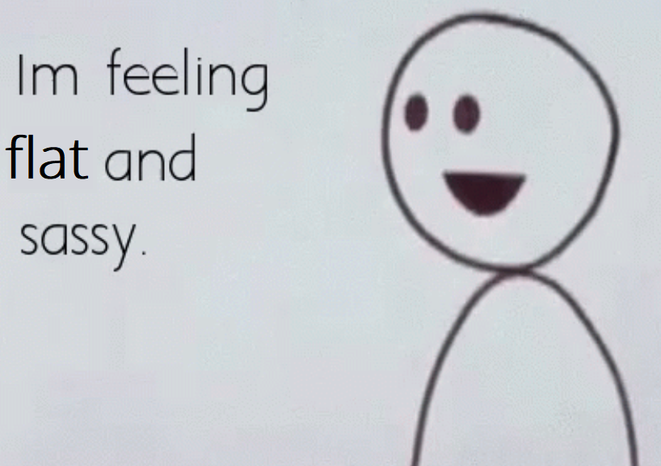

```{r setup, purl=FALSE}
#| include: false
options(width = 68)
knitr::opts_chunk$set(eval=TRUE, echo=TRUE, message=TRUE, warning=TRUE, dev = "svg")
```


# Course Goals


* Cultivate basic competence with applied statistics

  * *We'll start this next week*

--

* Develop intermediate R data management and visualization skills

  * *We'll start this today*

--

* Prepare you for advanced topics in quantitative analysis


--

* Introduce reproducible research practices

---
class: inverse

.text-align-center[
# Why are you doing this to me?
]

---

# Reasons

--

### You *will* read quantitative research

* Interpretation
* Evaluation

--

### You *may* do quantitative research

* Analysis
* Reporting

--

Pratt (2015):

.text-72[
> And another good reason to have a strong – and more importantly, eclectic – methodological skill‐set is so that you will not have to define (and therefore confine) yourself as either a quantitative or qualitative criminologist (although some people enthusiastically embrace such labels). You can instead call yourself a criminologist and be safe in the knowledge that you have command of whatever methodological “tool” you will need to answer whatever criminological question you have decided to ask.

]


---
class: inverse

.text-center[
# Okay, but programming?
]

---

.text-center[
# Data *analysis*<br>is mostly<br>data *wrangling*
]

.footnote[Credit: Kieran Healy]

--

&nbsp;

.text-center[
## Data wrangling is **frustrating**
]

---
class: inverse

# Well, can we make it fun?

---

&nbsp;

&nbsp;

&nbsp;

&nbsp;

.text-big-center[
**NO**
]

---
class: inverse

# Can we at least make it not frustrating?

---

&nbsp;

&nbsp;

.text-big-center[
**ALSO<br>NO**
]

---
# Programming is *important*

* Cleaning data by hand is:

  * Error prone
  * Time consuming
  * Not **reproducible**

--

* It opens *many* doors

  * New avenues of research
  * Non-academic jobs
  * Side hustles
  * Improved work flows *even without data*

--

.text-center[
## The frustration is *always* present
]

--

.text-center[
## but you get used to it
]

---

# Logistics

Location: Computer Lab, Wed, 14:00-16:00

Natalia's email: [nc603@cam.ac.uk]()

* Your first point of contact for troubleshooting!

My email: [cl948@cam.ac.uk]()

* For non-troubleshooting questions—or *really* broken stuff

My drop-in times:

* 3.9, Tue, 14:00-15:00
* 3.9, Wed, 12:00-13:00

[Make an appointment](https://calendar.app.google/no1vwGmXcs5yHVff9)

---

# Materials

All course materials are on the course website: [http://clanfear.github.io/ioc_iqa](). 

This includes:

* These slides and the code used to generate them.
* An R script for the slides to follow along in class.
* Useful links to other resources.
* **Formative assignments**

If something doesn't work, email me.

---

# A Note on Slide Formatting

**Bold** is an important term.

--

*Italics* are emphasis or mouse-click instructions

* "Click *File \> Print*"

--

`Code` is R code you type in or keystrokes for actions

* "Press `Ctrl-P` to open the print dialogue."

--

Code chunks are *actual embedded R code*.

```{r}
#| code-line-numbers: "1|2"
# Sometimes important stuff is highlighted! #<<
7 * 49
```

`##` indicates the output from running the code chunk.

---
class: inverse

# R and RStudio

<br>


---

# Why R?

R is a programming language built for statistical computing.

If one already knows Excel, SPSS, or Stata, why use R?

--

* R is *free*.

--

* R has a *very* large community for support and packages.

--

* R can handle virtually any data format.

--

* R makes replication *easy*.

--

* R is a *language* so it can do *everything*.<sup>1</sup>

.footnote[[1] Including making these slides and the course webpage.]

--

* R is similar to other common programming languages, e.g.:

   * Python
   * Javascript
   * Julia
   * SQL

---

# R Studio

R Studio is a "front-end" or integrated development environment (IDE) for R that can make your life *easier*.

--

We'll show RStudio can...

* Organize your code, output, and plots

--

* Auto-complete code and highlight syntax

--

* Help view data and objects

--

* Enable easy integration of R code into documents with **Quarto** and **RMarkdown**

--

It can also...

* Manage `git` repositories

* Run interactive tutorials

* Handle other languages like Python, SQL, and HTML

---

# Getting Started

Open up RStudio now and choose *File \> New File \> R Script*.

--

Then, let's get oriented with the interface:

* *Top Left*: Code **editor** pane, data viewer (browse with tabs)


* *Bottom Left*: **Console** for running code (`>` prompt)

* *Top Right*: List of objects in **environment**, code **history** tab.

* *Bottom Right*: Tabs for browsing files, viewing plots, managing packages, and viewing help files.


You can change the layout in *Preferences \> Pane Layout*

---

# Editing and Running Code

There are several ways to run R code in RStudio:

--

* Highlight lines in the **editor** window and click *Run* at the top or hit `Ctrl+Enter` or `⌘+Enter` to run them all.

--

* With your **caret** (.blink[`|`]) on a line you want to run, hit `Ctrl+Enter` or `⌘+Enter`. Note your caret moves to the next line, so you can run code sequentially with repeated presses.

--

* Type individual lines in the **console** and press `Enter`.

The console will show the lines you ran followed by any printed output.

---

# Incomplete Code

If you mess up (e.g. leave off a parenthesis), R might show a `+` sign prompting you to finish the command:

```{r Coding 1, eval=FALSE}
> (11-2
+
```

Finish the command or hit `Esc` to get out of this.

---

# R as a Calculator

In the **console**, type `123 + 456 + 789` and hit `Enter`.

--

```{r Calc 1}
123 + 456 + 789
```

--

The `[1]` in the output indicates the numeric **index** of the first element on that line.

--

Now in your blank R document in the **editor**, try typing the line `sqrt(400)` and either clicking *Run* or hitting `Ctrl+Enter` or `⌘+Enter`.

--

```{r Calc 2}
sqrt(400)
```

---
# Functions and Help

`sqrt()` is an example of a **function** in R.

--

If we didn't have a good guess as to what `sqrt()` will do, we can type `?sqrt` in the console and look at the **Help** panel on the right.

```{r Help, eval=FALSE}
?sqrt
```

--

**Arguments** are the *inputs* to a function. In this case, the only argument to `sqrt()` is `x` which can be a number or a vector of numbers.

Help files provide documentation on how to use functions and what functions produce.

---

# Creating Objects

R stores *everything* as an **object**, including data, functions, models, and output.

--

You can give an object a name using the **assignment operator**: `<-`

--

```{r Objects 1}
new.object <- 144
```

--

**Operators** like `<-` are functions that look like symbols but typically sit between their arguments (e.g. numbers or objects) instead of having them inside `()` like in `sqrt(x)`.<sup>1</sup>

.footnote[[1] We can call operators like other functions using backticks: <code>\`+\`(x,y)</code>]

--

We do math with operators, e.g., `x + y`. `+` is the addition operator!

--

Object names can contain `_` and `.` in them, but cannot *begin* with numbers. Try to be consistent in naming objects.

--

Auto-complete means *long names are better than vague ones*!

*Good names* save confusion later.

---

# Using Objects

You can display or "call" an object simply by using its name.

```{r Objects 2}
new.object
```

--

You can treat the object's **name** as if it were the values assigned to it.

--

```{r Objects 3}
new.object + 10
new.object + new.object
sqrt(new.object)
```

---

# Creating Vectors

A **vector** is a series of **elements**, such as numbers.

--

You can create a vector using the function `c()` which stands for "combine".

--

```{r Vectors 1}
new.object <- c(4, 9, 16, 25, 36)
new.object
```

--

Assigning to an existing name *overwrites that object*.

--

You can provide a vector as an argument for many functions.

--

```{r Vectors 2}
sqrt(new.object)
```

---

# Character Vectors

We often work with data that are categorical. To create a vector of text elements—**strings** in programming terms—we must place the text in quotes:

```{r}
string.vector <- c("Atlantic", "Pacific", "Arctic")
string.vector
```

--

Categorical data can also be stored as a **factor**, which has an underlying numeric representation.<sup>1</sup>

```{r}
factor.vector <- factor(string.vector)
factor.vector
```

.footnote[[1] Factors have **levels** which you can use to set a reference category in models using `relevel()`. We'll use this in a few weeks.]

---
# Saving and Loading Objects

You can save an R object on your computer as a file to open later:
```{r}
save(new.object, file="new_object.RData")
```

--

You can open saved files in R as well:
```{r}
load("new_object.RData")
```

--

But where are these files being saved and loaded from?

---

# Working Directories

R saves files and looks for files to open in your current **working directory**<sup>1</sup>. You
can ask R what this is:

.footnote[[1] For a simple R function to open an Explorer / Finder window at your working directory, [see this StackOverflow response](https://stackoverflow.com/a/12135823/10277284).]

```{r}
getwd()
```

--

Similarly, we can set a working directory like so:

```{r, eval=FALSE}
setwd("C:/Users/")
```

---

# More Complex Objects

The same principles can be used to create more complex objects:

* **matrices**
* **arrays**
* **lists**
* **dataframes**

--

Most data sets you will work with will be read into R and stored as a **dataframe**. 

Consequently, we will focus on manipulating and analyzing these dataframes.

---
class: inverse

# Data Frames

## AKA flat files or spreadsheets

<br>



---

# What's Up with `USArrests`?

In our R script, let's load the built-in dataframe `USArrests`. 

--

```{r}
data(USArrests)
```


`data(USArrests)` loads this dataframe into the **Global Environment** (as a *promise*<sup>1</sup>).

.footnote[[1] Promises are *unevaluated arguments*. Read more about R's [lazy evaluation here](http://adv-r.had.co.nz/Functions.html).]

--

`View(USArrests)` pops up a **Viewer** pane ("interactive" use only, don't put in R Markdown document!) or...

--

```{r}
head(USArrests, 5) # prints first 5 rows, see tail() too
```

---

# More About `USArrests`

`str()` displays the structure of an object:

.text-85[
```{r}
str(USArrests) # str[ucture]
```
]

--

`summary()` displays summary information<sup>1</sup>:

.text-85[
```{r}
summary(USArrests)
```
]

.footnote[[1] Note R `summary()` provides different information for different types of objects!]

---
class: inverse

&nbsp;

&nbsp;

&nbsp;


---

# Installing Packages

Let's give you a way to practice basics on your own. To do this, we'll want to install a **package** called `swirl`

Packages contain premade functions and/or data we can use. R's strength comes from packages!

In the console, type `install.packages("swirl")`.

--

* Note that *the name of a package to be installed must be in quotes*. This is because the name here is a search term (text), not an object!.

--

* Once you install a package, you don't need to re-install it until you update R. *Consequently, you should not include* `install.packages()` *in an R script!*

--

We can load packages like `swirl` using the `library()` function.

```{r, eval=FALSE}
library(swirl)
```

You could then use `swirl()` to start tutorials.

---
class: inverse

# For Next Time

* [Check out the IQA website](https://clanfear.github.io/ioc_iqa/_site/)

* Try out some `swirl` tutorials
   * Use `library(swirl)` to load the package
   * Once loaded, use `swirl()` to start the tutorial interface
      * *READ THE INSTRUCTIONS*
   * Try out `R Programming` lessons---we're up to the equivalent of about 5

* Read first two chapters of Kaplan (2022)
   * Try to run the code in Chapter 2 as you read

If you run into R problems you can't get past quickly, send an email or just set it aside until next week!
