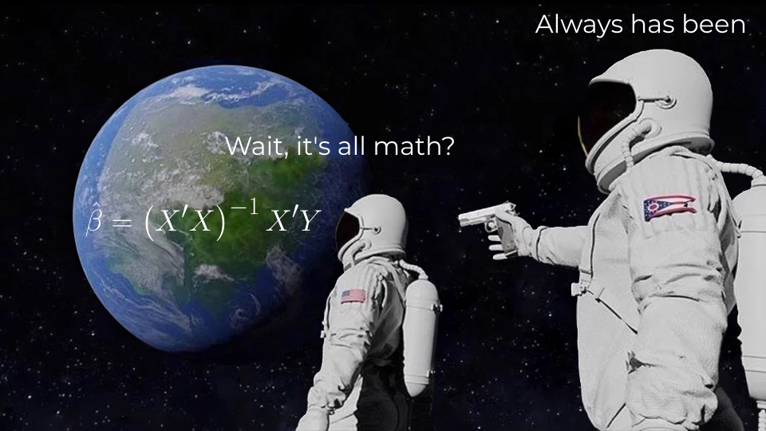

```{r setup, purl=FALSE}
#| include: false
options(width = 68)
knitr::opts_chunk$set(eval=TRUE, echo=TRUE, message=TRUE, warning=TRUE, dev = "svg")
```

# Today

* Math Review

   * Variables, vectors, and matrices
   
   * Lines and curves
   
   * Derivatives

* Programming

   * Indexing and Subsetting
   
   * Logical Expressions

---
class: inverse
# Math Review



---
## Variables

**Variables** are symbols representing sets of one or more **elements** which might take any number of values.

* Letters like $x$, $y$, and $z$ are commonly used to indicate variables.

  * e.g., $x = 3$

--

* Capital letters ( $X$ ) or letters with an index ( $x_i$ ) refer to variables with multiple values—that is, with *dimensions*.
  * e.g.: $X = x_i = (3,4,5)$


--

* Subscripts like $x_i$ are used to **index** elements of vectors.

   * $i$ here is itself a variable that indicates the position indexed

--

   * $x_1 = 3$, $x_2 = 4$, $x_3 = 5$


---
## Vectors in R

```{r}
x <- c(3, 4, 5) # Create x, a vector of length 3
x
```

--

Indexing $x_3$:

```{r}
x[3] # Get the third element of x
```

--

We can index multiple elements.

Index $x_2$ and $x_3$:

```{r}
x[c(2,3)] # Get the second and third elements of x
```

---
## Matrices

**Matrices** are rectangular tables of numbers. They're typically indicated by a capital letter, e.g., $X$


$$X_{i,j} = \begin{bmatrix}x_{1,1} & x_{1,2}\\x_{2,1} & x_{2,2}\end{bmatrix}$$

Matrices are indexed with subscripts for *rows*, *columns* (e.g., $x_{ij}$)

--

$$X = \begin{bmatrix}3 & 5\\4 & 6\end{bmatrix} \;\;\; x_{2,1} = 4$$


--

&nbsp;

$$X = \begin{bmatrix}6 & 2 & 3\\1 & 9 & 5\\4 & 8 & 0\end{bmatrix} \;\;\; \text{What is } x_{3,2}?$$

---

## Matrices in R

```{r}
(X <- matrix(c(6,1,4,2,9,8,3,5,0), nrow = 3))
```


Note R shows indices on the margins to tell you how to subset.

--

```{r}
X[3,2] # Third row, second column
```

--

We can take multiple elements of a matrix too (and shake up the order):

```{r}
X[3,c(2,1)] # Third row, second and first column
```

---

## Summation

$$\sum_{i=1}^{n}x_i$$

"Sum all values of $x$ from the first ( $i=1$ ) until the last ( $n$ )"

--

Given $x = [7, 11, 11, 13, 26]$:

$$\sum_{i=1}^{n}x_i = x_1 + x_2 + x_3 + x_4 + x_5 = 7 + 11 + 11 + 13 + 26 = 68$$

--

```{r}
x <- c(7, 11, 11, 13, 26)
sum(x)
```

Often when summing all elements of a vector, the sub/super scripts are hidden

* e.g. $\sum x_i = \sum_{i=1}^{n}x_i$

---
class: inverse

# Measures of Central Tendency

### Otherwise known as averages

&nbsp;


---

## Mean

The (arithmetic) mean is the *expected value* of a variable.

$$\bar{x} = \frac{1}{n}\sum_{i=1}^{n}x_{i}$$

--

If you draw randomly from that variable, the mean would be the least wrong single guess you could make about that value.<sup>1</sup>

Put another way, if you draw from the variable many times, the positive and negative differences from the mean balance out.

.footnote[[1] Technically the mean minimizes the *squared error*.]

--

```{r}
(1/length(x)) * sum(x) # Mean formula
```

```{r}
mean(x) # Mean function is just a shortcut
```


---

## Median

The value for which no more than half of the values are either higher *or* lower.<sup>1</sup>

.footnote[[1] Technically the median minimizes the *absolute error*.]

--

The **median** has this heinous formula:

$$m(x_i) = \begin{cases} x_{\frac{n+1}{2}},& \text{if } n \text{ odd}\\ \frac{1}{2}(x_{\frac{n}{2}} + x_{\frac{n}{2} + 1}), &\text{if } n \text{ even}\end{cases}$$


"If $x$ has an odd number of elements, the median is the middle one. If $x$ has an even number of elements, the median is the mean of the middle two."

--

```{r}
x[(length(x) + 1) / 2] # length(x) is the number of elements
```


```{r}
median(x)
```


---

## Mode

The **mode** is the most **frequent** value in the variable.

--

There are formulas for the mode, but they aren't very intuitive, despite it being the most intuitive measure of central tendency.

--

You can use a `table()` to see frequencies of values:

```{r}
table(x)
```

--

And you can find the mode directly (we'll learn this later today!):

```{r}
table(x)[table(x) == max(table(x))] # Subsetting!
```

.pull-right[.footnote["Subset the table to when the count is equal to the highest value."]]

---
# Extreme Values

The mean is sensitive to extreme values:

```{r}
z <- c(2, 5, 3, 5, 95)
mean(z)
```

--

The median is not:

```{r}
median(z)
```

--

This means the median may be a more useful "average" when your data have extreme values.

This is common with things like income or self-reported number of crimes committed—these always have **clumping** that makes the mode misleading (e.g., many zeroes)!

---
class: inverse

# Measures of Dispersion

## How spread out something is

&nbsp;


---

## Variance

The variance measures how dispersed data are around the mean. Typically we use the *sample* variance:

$$
s^2 = \frac{\sum (x_i - \bar{x})^2}{n - 1}
$$

We'll see this in action next week when we look at distributions.

--

```{r}
(s2 <- sum((x - mean(x))^2) / (length(x) -1))
var(x)
```

--

If every value is the same, the variance is *zero*.

---

## Standard Deviation

The standard deviation ( $s$ or $sd$ ) is just the root of the variance:

$$s = sd = \sqrt{s^2}$$

--

You can interpret it as the "typical" distance of values in the data from the mean.

--

```{r}
sqrt(var(x))
sd(x)
```

---
class: inverse

# Lines

&nbsp;

&nbsp;


---

# Cartesian Plane

```{r, echo=FALSE}
#| fig.height = 5
plot(x=c(-10, 10), y=c(-10, 10), type="n")
abline(h=0, lty = "dashed")
abline(v=0, lty = "dashed")
text(x = c(0, 6, 0), y = c(0, 0, 6), labels = c("Origin", "X-Axis", "Y-Axis"), cex = 1.5, col = "red")
```


---

# Slope-Intercept

Mathematically, lines can be defined by a slope and an intercept.

--

You've seen this before, perhaps many moons ago:

$$y = mx + b$$

--

We'll restate it this way:

$$y = a + bx$$

--

$a$ is the **intercept**

* The value of $y$ when $x = 0$

--

$b$ is the **slope**

* The units of $y$ the line rises for every unit increase in $x$
* You can restate this as the *ratio* that $y$ increases relative to $x$

---

# Intercept


$y = 1 + 0.5x$


```{r}
#| fig.height: 3.5
plot(c(0,5), c(0,5), type = "n", xlab = "x", ylab = "y")
abline(a = 1, b = 0.5)
```


The line *intercepts* the y-axis at 1.

---
# Intercept

$y = 3 + 0.5x$

```{r}
#| fig.height: 3.5
plot(c(0,5), c(0,5), type = "n", xlab = "x", ylab = "y")
abline(a = 3, b = 0.5)
```

The line *intercepts* the y-axis at 3.

---
# Intercept

$y = 2 + 0.5x$

```{r}
#| fig.height: 3.5
plot(c(0,5), c(0,5), type = "n", xlab = "x", ylab = "y")
abline(a = 2, b = 0.5)
```

The line *intercepts* the y-axis at 2.

---
# Slope

$y = 2 + 0.5x$

```{r}
#| fig.height: 3.5
plot(c(0,5), c(0,5), type = "n", xlab = "x", ylab = "y")
abline(a = 2, b = 0.5)
```

From 2, the line increases by 0.5 for every $x$.

---
# Slope

$y = 2 + 0x$

```{r}
#| fig.height: 3.5
plot(c(0,5), c(0,5), type = "n", xlab = "x", ylab = "y")
abline(a = 2, b = 0)
```

From 2, the line increases by 0 for every $x$.

---
# Slope

$y = 2 + 2x$

```{r}
#| fig.height: 3.5
plot(c(0,5), c(0,5), type = "n", xlab = "x", ylab = "y")
abline(a = 2, b = 2)
```

From 2, the line increases by 2 for every $x$.

---
class: inverse

# A little bit of calculus

&nbsp;


---

## Derivatives

* The **derivative** (e.g.,  $\frac{dy}{dx}$ ) is a *function* giving the rate of change (the slope) at a given point of another function (like a line or curve)

--

* Interpret $d$ as "a little bit of"


--

* $\frac{dy}{dx}$ is the little increase in $y$ given a little increase in $x$ *at any given point* of the function that generates $y$ (e.g., $y = 2x$)


--

* For a straight line, this is the same everywhere—it has a constant slope.

--

* For curves, the slope is different depending on where on the curve you're looking.

--

* A derivative lets us find exactly what that slope is wherever we want to look


---
# Polynomial curves

You can define a curve in the same line formula:

$$y = 2 + 0.5x + 0.25x^2$$

--

A *squared* or **quadratic** term (e.g. $x^2$) creates a *parabola*.

```{r}
#| fig.height: 3.5
#| fig.width: 6
#| fig.align: "left"
curve(2 + 0.5*x + 0.25*x^2, from = -2, to = 2, ylab = "y")
```

--

.pull-right-30[
.footnote[
What is the slope of this curve?
]
]

---
# Taking the Derivative

While a curve has many different slopes, all those slopes can be defined by a single derivative<sup>1</sup>

.footnote[[1] At least for any curves we're going to talk about!]

--

Given $y = a + x^n$, $\frac{dy}{dx} = nx^{n-1}$

Basic rules:

* Delete any terms without $x$ (e.g., $a$ gets dropped)
* Premultiply by exponents, then divide by $x$ (e.g.,  $x^3$ becomes $3x^2$ )

--

So...

* $y = 2 + 0.5x + 0.25x^2$
* $\frac{dy}{dx} = 0.5 + 0.5x$
* When $x = 3$ the slope is $0.5 + 0.5*3 = 2$.

---

# Cubic Derivative

These rules work for polynomials with more terms.

--

$$y = 35 + 3x + 0.5x^2 + 0.25x^3$$

--

1. Drop the constant (35)
2. Multiple the coefficients by the exponents
3. Divide by $x$ (i.e., reduce the exponents by 1)

--

$$\frac{dy}{dx} = 3 + x + 0.75x^2$$

--

When $x = 2$ the slope is...

```{r}
x <- 2
3 + x + 0.75*x^2
```

---
class: inverse
# Why am I learning this?

---
# Reasons

--

It will be clear soon, but for now:

--

* Most statistical models are estimators of *conditional* means, medians, or modes

   * e.g., the mean of $y$ when $x$ takes some value

--

* Model uncertainty is estimated using *variances*

--

* Models are estimated using matrices and calculus

   * *Which I won't make you do by manually*

--

* The most used model parameters tell us how $y$ changes when $x$ changes

   * e.g., coefficients or marginal effects

--

* Those are *derivatives*

---
# Okay, that's enough maths

---
class: inverse
# Oh, thank god

---
# Time for more code

---
class: inverse

&nbsp;

.text-big-center[
BOO
]

---
class: inverse
# Indexing and Subsetting
## Base R

---

# Indices and Dimensions

There are two main ways index objects: square brackets (`[]` or `[[]]`) and `$`. How you access an object depends on its *dimensions*.

--

Dataframes have *2* dimensions: **rows** and **columns**. Brackets **subset** using `object[row, column]`. Leaving the row or column place empty selects *all* elements of that dimension.

.small[
```{r}
USArrests[1,] # First row
```
]
--
.small[
```{r}
USArrests[1:3, 3:4] # First three rows, third and fourth column #<<
```
]

.pull-right[
.footnote[
The **colon operator** (`:`) generates a vector using the sequence of integers from its first argument to its second. `1:3` is equivalent to `c(1,2,3)`.
]
]

---

# Using Names

We can also subset using the names of rows or columns:

```{r}
USArrests["California",]
```

--

```{r}
head(USArrests[, c("Murder", "UrbanPop")])
```

---

# Single columns

If you subset to a single column, it returns it as a vector instead of a dataframe:

```{r}
USArrests[, "Murder"]
```

--

*Columns* in dataframes can also be accessed using names with the `$` extract operator:

```{r}
USArrests$Murder
```

---

# Extract: `$`

You may have noticed `$` before when we used `str()`:

```{r}
str(USArrests)
```

Like the matrix subsetting suggestions, it is a hint you can select columns that way.

---

# Mix and Match

```{r}
USArrests$Murder[1:10]
```

Note here I *also* used brackets to select just the first 10 elements of that column.

--

You can mix subsetting formats! In this case I provided only a single value (no column index) because **vectors** have *only one dimension* (length).

* R first processes the `$Murder`
* Then it processes the `[1:10]`

--

If you try to subset something and get a warning about "incorrect number of dimensions", check your subsetting!

---
class: inverse

# Logical Expressions

&nbsp;

&nbsp;


---

# Indexing by Expression

We can also index using expressions—logical *tests*.

```{r}
USArrests[USArrests$Murder > 15, ]
```

--

What does this give us?


---

# How Expressions Work

What does `USArrests$Murder > 15` actually do? 

--

```{r}
USArrests$Murder > 15
```

--

It returns a vector of `TRUE` or `FALSE` values.

When used with the subset operator (`[]`), elements for which a `TRUE` is given are returned while those corresponding to `FALSE` are dropped.

---

# Logical Operators

We used `>` for testing "greater than": `USArrests$Murder > 15`.

--

There are many other [logical operators](http://www.statmethods.net/management/operators.html):

--
* `==`: equal to

--
* `!=`: not equal to

--
* `>`, `>=`, `<`, `<=`: less than, less than or equal to, etc.

--
* `%in%`: used with checking equal to one of several values

--

Or we can combine multiple logical conditions:

* `&`: both conditions need to hold (AND)
--

* `|`: at least one condition needs to hold (OR)
--

* `!`: inverts a logical condition (`TRUE` becomes `FALSE`, `FALSE` becomes `TRUE`)

--

Logical operators are one of the foundations of programming. You should experiment with these to become familiar with how they work!

---

# And: `&`


```{r}
USArrests[USArrests$Murder > 15 & USArrests$Assault > 300, ]
```


---

# Or: `|`


```{r}
USArrests[USArrests$Murder > 15 | USArrests$Assault > 300, ]
```


---

# Sidenote: Missing Values

Missing values are coded as `NA` entries without quotes:

```{r}
vector_w_missing <- c(1, 2, NA, 4, 5, 6, NA)
```

--

Even one `NA` "poisons the well": You'll get `NA` out of your calculations unless you remove them manually or use the extra argument `na.rm = TRUE` in some functions:

```{r}
mean(vector_w_missing)
```

--

We can take missings (`NA`) and remove (`rm`) them:

```{r}
mean(vector_w_missing, na.rm=TRUE)
```

---
# Finding Missing Values

**WARNING:** You can't test for missing values by seeing if they "equal" (`==`) `NA`:

```{r}
vector_w_missing == NA
```

--

But you can use the `is.na()` function:

```{r}
is.na(vector_w_missing)
```

--

We can use subsetting to get the equivalent of `na.rm=TRUE`:

```{r}
mean(vector_w_missing[!is.na(vector_w_missing)]) #<<
```


.footnote[
`!` *reverses* a logical condition. Read the above as "subset to *not* `NA`"
]

---
class: inverse

# For Next Time

* Read Kaplan chapters 3 and 4

* Try a bit more `swirl`