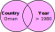

```{r setup, purl=FALSE}
#| include: false
knitr::opts_chunk$set(eval=TRUE, echo=TRUE, message=TRUE, warning=TRUE)
```

```{r xaringan-themer, include=FALSE, warning=FALSE, purl=FALSE}
library(xaringanthemer)
style_duo_accent(
  white_color = "#f0f1eb",
  black_color = "#28282B",
  primary_color = "#003C71",
  secondary_color = "#8A1538",
  header_font_google = google_font("Montserrat"),
  text_font_google   = google_font("Open Sans"),
  code_font_google   = google_font("Fira Mono"),
  padding = "16px 32px 16px 32px",
  text_font_size = "1.1rem",
  code_font_size = "1.1rem"
)
```

# Today

* Math Review
   * Variables, vectors, and matrices
   * Lines and curves
   * Derivatives
* Data manipulation with `dplyr`

---
class: inverse
# Math Review

---
## Variables

**Variables** are symbols representing sets of one or more **elements** which might take any number of values.

* Letters like $x$, $y$, and $z$ are commonly used to indicate variables.

  * e.g., $x = 3$

--

* Capital letters ($X$) or letters with an index ($x_i$) refer to variables with multiple values---that is, with *dimensions*.
  * e.g.: $X = x_i = (3,4,5)$


--

* Subscripts like $x_i$ are used to **index** elements of vectors.

   * $i$ here is itself a variable that indicates the position

--

   * $x_1 = 3$, $x_2 = 4$, $x_3 = 5$


---
## Vectors in R

```{r}
x <- c(3, 4, 5) # Create x
x
```

--

Getting $x_3$:

```{r}
x[3] # Get the third element of x
```

--

We can index multiple elements.

Get $x_2$ and $x_3$:

```{r}
x[c(2,3)] # Get the second and third elements of x
```

---
## Matrices

**Matrices** are rectangular tables of numbers. They're typically indicated by a capital letter, e.g., $X$

&nbsp;

$X_{i,j} = \begin{bmatrix}x_{1,1} & x_{1,2}\\x_{2,1} & x_{2,2}\end{bmatrix}$

&nbsp;

Matrices are indexed with subscripts for *rows*, *columns* (e.g., $x_{ij}$)

--

&nbsp;

.pull-left[
$X = \begin{bmatrix}3 & 5\\4 & 6\end{bmatrix}$
]
.pull-right[
$x_{2,1} = 4$
]


---
## Matrices in R

```{r}
(X <- matrix(c(3,4,5,6), nrow = 2))
```

Note R shows indices on the margins to tell you how to subset.

```{r}
X[2,1]
```

---
## Summation

$\sum_{i=1}^{n}x_i$

"Sum all values of $x$ from the first ($i=1$) until the last ($n$)"

--

Given $x = [7, 11, 11, 13, 26]$

$x_1 + x_2 + x_3 + x_4 = 7 + 11 + + 11 + 13 + 26$

--

```{r}
x <- c(7, 11, 11, 13, 26)
sum(x)
```
Often when summing all elements of a vector, the sub/super scripts are hidden

* e.g. $\sum x_i = \sum_{i=1}^{n}x_i$

---
class: inverse

# Measures of Central Tendency

### Otherwise known as averages

---

## Mean

The mean is the *expected value* of a set of variable.

$\bar{x} = \frac{1}{n}\sum_{i=1}^{n}x_{i}$

--

That is, if you draw randomly from that variable, the mean would be the best guess.<sup>1</sup>

.footnote[[1] Technically the mean minimizes the *squared error* of guesses.]

--

```{r}
(1/length(x)) * sum(x)
```

```{r}
mean(x)
```


---

## Median

The **median** has this heinous formula:

$m(x_i) = \begin{cases} x_{\frac{n+1}{2}},& \text{if } n \text{ odd}\\ \frac{1}{2}(x_{\frac{n}{2}} + x_{\frac{n}{2} + 1}), &\text{if } n \text{ even}\end{cases}$


"If $x$ has an odd number of elements, the median is the middle one. If it has an even number of elements, average the middle two."

--

```{r}
x[(length(x) + 1) / 2]
```


```{r}
median(x)
```

---

## Mode

The **mode** is the most common value in the variable.

--

There are formulas for the mode, but they aren't very intuitive, despite it being the most intuitive measure of central tendency.

--

You can use a `table()` to see frequencies of values:

```{r}
table(x)
```

--

And you can find the mode directly:

```{r}
table(x)[table(x)==max(table(x))]
```

---
# Extreme Values

The mean is sensitive to extreme values:

```{r}
z <- c(2, 5, 3, 5, 95)
mean(z)
```

--

The median (and mode) are not:

```{r}
median(z)
```

--

This means the median may be a more useful "average" when your data have a small number of extreme values.

This is common with things like income or self-reported number of crimes committed.

---

# Measures of Dispersion

---

## Variance<sup>1</sup>

The variance measures how dispersed data are around the mean. Typically we use the *sample* variance:

$$
s^2 = \frac{\sum (x_i - \bar{x})^2}{n - 1}
$$

We'll see this in action next week when we look at distributions.

--

```{r}
(s2 <- sum((x - mean(x))^2) / (length(x) -1))
var(x)
```

--

If every value is the same, the variance is *zero*.

---

## Standard Deviation

The standard deviation ($s$ or $sd$) is just the root of the variance:

$s = sd = \sqrt{s^2}$

--

You can interpret it as the "typical" distance from values in the data from their mean.

--

```{r}
sqrt(var(x))
sd(x)
```

---
class: inverse
# Lines

---

# Slope-Intercept

Mathematically, lines can be defined by a slope and an intercept.

--

You've seen this before, perhaps many moons ago:

$y = mx + b$

--

We'll restate it this way:

$y = a + bx$

--

$a$ is the **intercept**

* The value of $y$ when $x = 0$

--

$b$ is the **slope**

* The units of $y$ the line changes for every unit of $x$
* You can restate this as the *ratio* that $y$ increases relative to $x$

---

# Intercept


$y = 1 + 0.5x$


```{r}
#| fig.height: 3.5
plot(c(0,5), c(0,5), type = "n", xlab = "x", ylab = "y")
abline(a = 1, b = 0.5)
```


The line *intercepts* the y-axis at 1.

---
# Intercept

$y = 3 + 0.5x$

```{r}
#| fig.height: 3.5
plot(c(0,5), c(0,5), type = "n", xlab = "x", ylab = "y")
abline(a = 3, b = 0.5)
```

The line *intercepts* the y-axis at 3.

---
# Intercept

$y = 2 + 0.5x$

```{r}
#| fig.height: 3.5
plot(c(0,5), c(0,5), type = "n", xlab = "x", ylab = "y")
abline(a = 2, b = 0.5)
```

The line *intercepts* the y-axis at 2.

---
# Slope

$y = 2 + 0.5x$

```{r}
#| fig.height: 3.5
plot(c(0,5), c(0,5), type = "n", xlab = "x", ylab = "y")
abline(a = 2, b = 0.5)
```

From 2, the line increases by 0.5 for every $x$.

---
# Slope

$y = 2 + 0x$

```{r}
#| fig.height: 3.5
plot(c(0,5), c(0,5), type = "n", xlab = "x", ylab = "y")
abline(a = 2, b = 0)
```

From 2, the line increases by 0 for every $x$.

---
# Slope

$y = 2 + 2x$

```{r}
#| fig.height: 3.5
plot(c(0,5), c(0,5), type = "n", xlab = "x", ylab = "y")
abline(a = 2, b = 2)
```

From 2, the line increases by 2 for every $x$.

---
class: inverse

# A little bit of calculus

---

## Derivatives

* The **derivative** (e.g.,  $\frac{dy}{dx}$ ) is a *function* giving the rate of change (the slope) at a given point of another function (like a line or curve)

--

* Interpret $d$ as "a little bit of"


--

* $\frac{dy}{dx}$ is the little increase in $y$ given a little increase in $x$ *at any given point of the function*


--

* For a straight line, this is the same everywhere---it has a constant slope.

--

* For curves, the slope is different depending on where on the curve you're looking.

--

* A derivative lets us find exactly what that slope is wherever we want to look


---
# Polynomial curves

You can define a curve by augmenting the slope-intercept formula:

$y = 2 + 0.5x + 0.25x^2$

--

A *squared* or **quadratic** term ($x^2$) creates a *parabola*.

```{r}
#| fig.height: 3.5
#| fig.width: 6
curve(2 + 0.5*x + 0.25*x^2, from = -2, to = 2, ylab = "y")
```

--

.pull-right-30[
.footnote[
What is the slope of this curve?
]
]

---
# Taking the Derivative

While a curve has many different slopes, all those slopes can be defined by a single derivative<sup>1</sup>

.footnote[[1] At least for any curves we're going to talk about!]

--

Given $f(x) = a + x^n$, $\frac{d}{dx}f(x) = nx^{n-1}$

Basic rules:

* Delete any terms without $x$ (e.g., $a=2$)
* Premultiply by exponents and decrement it

--

So...

* $y = 2 + 0.5x + 0.25x^2$
* $\frac{dy}{dx} = 0.5 + 0.5x$
* When $x = 3$ the slope is $0.5 + 0.5*3 = 2$.

---
class: inverse
# Why am I learning this?

---
# Reasons

It will be clear soon, but for now:

--

* Most statistical models are estimators of *conditional* means, medians, or modes

   * e.g., the mean of $y$ when $x$ takes some value

--

* Model uncertainty is estimated using *variances*

--

* Models are estimated using matrices and calculus

   * *Which I won't make you do by manually*

--

* The most used model parameters tell us how $y$ changes when $x$ changes

   * e.g., coefficients or marginal effects

--

* Those are *derivatives*

---
# Okay, that's enough maths

---
class: inverse
# Oh, thank god

---
# Time for more code

---
class: inverse

.text-align-center[
# BOO
]

---
class: inverse

# Part II

## Files and basic `dplyr`


---

# Saving Files

You can save an R object on your computer as a file to open later:
```{r}
new.object <- 1:10 # Making vector of 1 to 10 
save(new.object, file="new_object.RData")
```

--

You can open saved files in R as well:
```{r}
load("new_object.RData")
```

--

But where are these files being saved and loaded from?

---

# Working Directories

R saves files and looks for files to open in your current **working directory**. You
can ask R what this is:

```{r}
getwd()
```

--

Similarly, we can set a working directory like so:

```{r, eval=FALSE}
setwd("C:/Users/cclan/Documents")
```

--

*Don't set a working directory in QUarto documents!* They automatically use the directory they are in as the working directory.

---
# Better: RStudio Projects

* In the top right of RStudio, there is a Project menu.

--

* This can be used to create or switch between RStudio projects

--

* When you open a project, it sets your working directory to the project folder

--

* It also preserves open scripts

---
# Organization Systems

Organizing research projects is something you either do accidentally—and badly—or purposefully with some upfront labor.

--

Uniform organization makes switching between or revisiting projects easier.

--

I suggest something like the following:

.pull-left[
```
project/
   readme.md
   data/
     derived/
       processed_data.RData
     raw/
       core_data.csv
   docs/
     paper.Rmd
   syntax/
     functions.R
     models.R
```
]
.pull-right[
1. There is a clear hierarchy
   * Written content is in `docs`
   * Code is in `syntax`
   * Data is in `data`
2. Naming is uniform
   * All lower case
   * Words separated by underscores
3. Names are self-descriptive

]


---

# File Types

We mainly work with three types of file in this class:

--

* `.qmd`: These are **Quarto** *syntax* files, where you write code to *make documents*.

--

* `.R`: These are **R** *syntax* files, where you write code to process and analyze data *without making an output document*.<sup>1</sup>

.footnote[[1] While beyond the scope of this class, you can use the `source()` function to run a `.R` script file inside a `.Rmd` or `.R` file. Using this you can break a large project up into multiple files but still run it all at once!]

--

* `.html` or `.pdf`: These are the output documents created when you *render* a Quarto document.

--

Make sure you understand the difference between the uses of these file types! Please
ask for clarification if needed!

---
class: inverse

# Data and Subsetting

---

# Shootings data

---

# Check Out Shootdings

 Let's see its structure:

.small[
```{r}
str(shootings)
```
]

---

# What's Interesting Here?

* **Factor** variables `country` and `continent`

   + Factors are categorical data with an underlying numeric representation
   + We'll spend a lot of time on factors later!

--

* Many observations: $n=`r nrow(gapminder)`$ rows

--

* A nested/hierarchical structure: `year` in `country` in `continent`

   + These are panel data!

---
class: inverse

# Subsetting Data


---

# Installing Tidyverse

We'll want to be able to slice up this data frame into subsets (e.g. just the rows for Afghanistan, just the rows for 1997).

We will use a package called `dplyr` to do this neatly.

`dplyr` is part of the [tidyverse](http://tidyverse.org/) family of R packages that are the focus of this course.

--

If you have not already installed the tidyverse, type, in the console: `install.packages("tidyverse")`

--

This will install a *large* number of R packages we will use throughout the term, including `dplyr`.

`dplyr` is a very useful and powerful package that we will talk more about soon, but today we're just going to use it for "filtering" data.

---

# Loading dplyr

```{r, message=TRUE}
library(dplyr)
```

---

# Wait, was that an error?

When you load packages in R that have functions sharing the same name as functions you already have, the more recently loaded functions overwrite the previous ones ("masks them").

--

This **message** is just letting you know that. To avoid showing this in your R Markdown file, add `message=FALSE` or `include=FALSE` to your chunk options when loading packages.

--

Sometimes you may get a **warning message** when loading packages---usually because you aren't running the latest version of R:

```
Warning message:
package `gapminder' was built under R version 3.5.3 
```
Chunk options `message=FALSE` or `include=FALSE` will hide this. *Update R* to deal with it completely!

---

# Pipes

We can use pipe operators (`|>`) to send data between functions. So instead of nesting functions like this:

```{r}
log(mean(gapminder$pop))
```

--

We can pipe them like this:

```{r}
gapminder$pop |> mean() |> log()
```

--

Read this as, "send `gapminder$pop` to `mean()`, then send the output of that to `log()`."
In essence, pipes read "left to right" while nested functions read "inside to out."
This may be confusing... we'll cover it more later!

---

# `filter` Data Frames

```{r}
gapminder %>% filter(country == "Algeria")
```

What is this doing?

---

# How Expressions Work

What does `country == "Algeria"` actually do? 

--

```{r}
head(gapminder$country == "Algeria", 50) # display first 50 elements
```

--

It returns a vector of `TRUE` or `FALSE` values.

When used with the subset operator (`[]`), elements for which a `TRUE` is given are returned while those corresponding to `FALSE` are dropped.

---

# Logical Operators

We used `==` for testing "equals": `country == "Algeria"`.

--

There are many other [logical operators](http://www.statmethods.net/management/operators.html):

--

* `!=`: not equal to
--

* `>`, `>=`, `<`, `<=`: less than, less than or equal to, etc.
--

* `%in%`: used with checking equal to one of several values

--

Or we can combine multiple logical conditions:

* `&`: both conditions need to hold (AND)
--

* `|`: at least one condition needs to hold (OR)
--

* `!`: inverts a logical condition (`TRUE` becomes `FALSE`, `FALSE` becomes `TRUE`)

--

We'll use these a lot so don't worry too much right now!

---

# Multiple Conditions Example


```{r}
gapminder %>%
    filter(country == "Oman" & year > 1980)
```

---
# Multiple Conditions

.pull-left[

### And: `&`

```{r, eval=FALSE}
gapminder %>% 
  filter(country == "Oman" &
         year > 1980)
```

.image-100[

]

*Give me rows where the country is Oman **and** the year is after 1980.*

]

--

.pull-right[

### Or: `|`

```{r, eval=FALSE}
gapminder %>%
  filter(country == "Oman" |
         year > 1980)
```

.image-100[

]

*Give me rows where the country is Oman **or** the year is after 1980... or **both**.*

]

---

# Saving a Subset

If we think a particular subset will be used repeatedly, we can save it and give it a name like any other object:

```{r}
China <- gapminder %>% filter(country == "China")
head(China, 4)
```