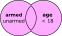

```{r setup, purl=FALSE}
#| include: false
options(width = 68)
knitr::opts_chunk$set(eval=TRUE, echo=TRUE, message=TRUE, warning=TRUE, dev = "svg")
```


# Things to include

* Distributions
   * Mean vs. median and skew
      * Logs and log-normals
   * Histograms
   * Barplots?
   * Densities
   * Tables for categoricals
   * skimr?

* Relationships
  * Mean differences between groups
     * Demonstrate conditional distributions
  * Crosstabs
  * Correlations


# Today

---
class: inverse

# Part II

## `dplyr`

---

# Installing Tidyverse

We're going to practice loading files and manipulating data.

--

We will use a packages called `readr` and `dplyr` to do this neatly.

These packages are part of the [tidyverse](http://tidyverse.org/) family of R packages that are the focus of this course.

--

If you have not already installed the tidyverse, type, in the console: `install.packages("tidyverse")`

--

This will install a *large* number of R packages we will use throughout the term, including `readr` and `dplyr`.

`dplyr` is a particularly useful package that we will talk more about next week, but today we're just going to use it for "filtering" data.

---

# Loading dplyr

```{r, message=TRUE}
library(dplyr)
library(readr)
```

---

# Wait, was that an error?

When you load packages in R that have functions sharing the same name as functions you already have, the more recently loaded functions overwrite the previous ones ("masks them").

--

This **message** is just letting you know that. To avoid showing this in your R Markdown file, add `message=FALSE` or `include=FALSE` to your chunk options when loading packages.

--

Sometimes you may get a **warning message** when loading packages---usually because you aren't running the latest version of R:

```
Warning message:
package `dplyr' was built under R version 4.2.0
```
Chunk options `message=FALSE` or `include=FALSE` will hide this. *Update R* to deal with it completely!

---
class: inverse
# Importing and Exporting Data

---

# Working Directories

Recall that R saves files and looks for files to open in your current **working directory**. 

You can find out what it is using the function `getwd()`.

On my computer when I knitted these slides, it happened to be:

```{r}
getwd()
```

---
# Changing Your Working Directory

You can use `setwd(dir = "C:/path/to/new/working/directory")` to change the working directory.

Working Directory Suggestions:

* Instead of setting a working directory, it is usually better to use [RStudio projects](https://support.rstudio.com/hc/en-us/articles/200526207-Using-Projects) to manage working directories.

--

* Windows users: If you copy a path from Explorer, make sure to change back slashes (`\`) to forward slashes (`/`) for the filepaths

--

* If you *need* to set a working, put `setwd()` at the start of your file so that someone using another computer knows they need to modify it

---
# Projects in RStudio

A better way to deal with working directories: RStudio's **project** feature in the top-right dropdown. This has lots of advantages:

--

* Sets your working directory to be the project directory.

--

* Remembers objects in your workspace, command history, etc. next time you re-open that project.

--

* Reduces risk of intermingling different work using the same variable names (e.g. `n`) by using separate RStudio instances for each project.

--

* Easy to integrate with version control systems (e.g. `git`)

--

   * I usually make each RStudio project its own GitHub repository.

---
# Delimited Text Files

One of the most common ways for data to be stored is in a *delimited* text file, e.g. comma-separated values (**.csv**) or tab-separated values (**.tsv**). Here is **.csv** data:

```
"Id","Offense","Sex","Month"
101,"Battery","Male",1,
101,"Battery","Male",1,
101,"Robbery","Male",1,
101,"Battery","Male",2,
101,"Robbery","Male",2,
101,"Homicide","Male",3,
103,"Robbery","Female",1,
103,"Robbery","Female",3,
103,"Battery","Female",4,
```

---
# `readr`

R has a variety of built-in functions for importing delimited text, like `read.table()` and `read.csv()`. I recommend using the versions in the `readr` package instead: `read_csv()`, `read_tsv()`, and `read_delim()`:

`readr` function features:

* Faster!
* A *little* smarter about dates and times
* Handy function `problems()` you can run if there are errors
* Loading bars for large files

---
# `readr` Importing Example

Let's import some data about fatal police shootings from Kaplan (2022).

We can use `read_csv()` from `readr` to assign the contents of a `.csv` file to a new dataframe.

.small[
```{r}
shootings <- 
  read_csv( 
    "https://clanfear.github.io/ioc_iqa/_data/fatal-police-shootings-data.csv"
    )
```
]

---

# Check Out Shootings

`dplyr` gives us access to the handy `glimpse()` for inspecting dataframes.

.text-62[
```{r}

glimpse(shootings)
```
]

---

# What's Interesting Here?

* **Character** variables, e.g. `state`, `manner_of_death`, `armed`

--

* Many observations: $n=`r nrow(shootings)`$ rows

--

* A nested/hierarchical structure: `people` in `states`

---
class: inverse

# Tidy Data Manipulation


---

# But first, pipes!

We can use pipe operators (`|>`) to send data between functions. So instead of nesting functions like this:

```{r}
sort(table(shootings$race))
```

--

We can pipe them like this:

```{r}
shootings$race |> table() |> sort()
```

--

Read this as, "send `shootings$race` to `table()`, then send the output of that to `sort()`."
In essence, pipes read "left to right" while nested functions read "inside to out."
This may be confusing... we'll cover it more later!

---

# `filter` Data Frames

```{r}
shootings %>% filter(armed == "unarmed")
```

What is this doing?


---

# Multiple Conditions Example


```{r}
shootings %>%
    filter(armed == "unarmed" & age < 18)
```

---
# Multiple Conditions

.pull-left[

### And: `&`

```{r, eval=FALSE}
shootings %>%
    filter(armed == "unarmed" & age < 18)
```

.image-100[

]

*Give me rows where the subject was unarmed **and** their age is under 18.*

]

--

.pull-right[

### Or: `|`

```{r, eval=FALSE}
shootings %>%
    filter(armed == "unarmed" |
          age < 18)
```

.image-100[

]

*Give me rows where the subject was unarmed **or** their age is under 18... or **both**.*

]

---

# Saving a Subset

If we think a particular subset will be used repeatedly, we can save it and give it a name like any other object:

```{r}
unarmed <- shootings %>% filter(country == "unarmed")
head(unarmed, 4)
```

---
