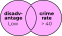

```{r setup, purl=FALSE}
#| include: false
options(width = 68)
knitr::opts_chunk$set(eval=TRUE, echo=TRUE, message=TRUE, warning=TRUE, dev = "svg")
```


# Today

* News items:
   * Two assessments
      * *Light* data analysis and interpretation
      * Due Friday 11:59 PM the following week
   * Michael's Office Hours: Thurs 13:00-14:00
      * Also by appointment
   * Reschedule Nov 15th to Monday, Nov 13th at 2 PM
      * Email immediately if this is a problem

* Topics for today:

   * Pipes 
   * Subsetting with `{dplyr}`
   * Creating and modifying variables
   * Distributions
      * Tabulations and Cross-Tabulations
      * Summarizing data
      * Correlations

---
class: inverse

# `{tidyverse}`

&nbsp;


---

# Installing `{tidyverse}`

We're going to practice loading files and manipulating data.

--

We will use a packages called `{readr}` and `{dplyr}` to do this neatly.

These packages are part of the [Tidyverse](http://tidyverse.org/) family of R packages

* These packages make using R *much easier*

--

If you have not already installed the tidyverse, type, in the console: `install.packages("tidyverse")`

--

This will install a *large* number of R packages we will use throughout the term, including `{readr}`, `{ggplot2}`, and `{dplyr}`.

---

# Loading Packages

```{r}
library(readr)
library(ggplot2)
library(dplyr)
```

---

# Wait, was that an error?

When you load packages in R that have functions sharing the same name as functions you already have, the more recently loaded functions overwrite the previous ones ("masks them").

--

This **message** is just letting you know that.

--

Sometimes you may get a **warning message** when loading packages—usually because you aren't running the latest version of R:

```
Warning message:
package `dplyr' was built under R version 4.3.0
```

*Update R* to get rid of these!

---
class: inverse
# Importing and Exporting Data

&nbsp;


---

# Delimited Text Files

One of the most common ways for data to be stored is in a *delimited* text file, e.g. comma-separated values (**.csv**) or tab-separated values (**.tsv**). Here is **.csv** data:

```
"Id","Offense","Sex","Month"
101,"Battery","Male",1,
101,"Battery","Male",1,
101,"Robbery","Male",1,
101,"Battery","Male",2,
101,"Robbery","Male",2,
101,"Homicide","Male",3,
103,"Robbery","Female",1,
103,"Robbery","Female",3,
103,"Battery","Female",4,
```

---
# `{readr}`

R has a variety of built-in functions for importing delimited text, like `read.table()` and `read.csv()`.

I recommend using the versions in the `{readr}` package instead: `read_csv()`, `read_tsv()`, and `read_delim()`:

`{readr}` function features:

* Faster!
* A *little* smarter about dates and times
* Handy function `problems()` you can run if there are errors
* Loading bars for large files

---

# `{readr}` Importing Example

Let's use `read_csv()` from `{readr}` to import some community crime data based on those in yesterday's CRM lecture

.small[
```{r}
communities <- 
  read_csv(
    "https://clanfear.github.io/ioc_iqa/_data/communities.csv"
    )
```
]


---
class: inverse

# `{dplyr}`

&nbsp;


---

# Check Out `communities`

`{dplyr}` gives us access to the handy `glimpse()` for inspecting dataframes.

.text-62[
```{r}
glimpse(communities)
```
]

---

# Pipes!

`{dplyr}` and rest of the Tidyverse are built around using pipe operators (`|>`)

Instead of nesting functions like this:

```{r}
proportions(table(communities$disadvantage))
```

--

We can pipe them like this:

```{r}
communities |> pull(disadvantage) |> table() |> proportions()
```

--

Read this as, "take `communities`, and then pull out the `incarceration` column, and then make a `table()`, and then calculate `proportions()`."

---

# `filter()` Data Frames

```{r}
communities |> filter(incarceration == "High") |> head()
```

.text-center[
*What is this doing?*
]

--

`filter()` is a `{dplyr}` function for indexing dataframe **rows**

--

It takes *only* logical vectors (the result of **expressions**) as an argument

---
# Multiple Conditions

.pull-left[

### And: `&`

```{r, eval=FALSE}
communities |>
  filter(disadvantage == "Low" & 
         crime_rate > 40)
```


]

--

.pull-right[

### Or: `|`

```{r, eval=FALSE}
communities |>
  filter(disadvantage == "Low" | 
         crime_rate > 40)
```



]

---
# `%in%` Operator

Common use case: Filter rows to things in some set.

We can use `%in%` like `==` but for matching any element in the vector on its right

```{r}
communities |>
  filter(disadvantage %in% c("High", "Low")) |>
  tail()
```

Read as: "`filter()` to rows where `disadvantage` is `"High"` or `"Low"`"

---
#Sorting: `arrange()`

Along with filtering the data to see certain rows, we might want to sort it:

```{r}
communities |>
  arrange(disadvantage, desc(crime_rate)) |> head()
```

The data are sorted by ascending `disadvantage` and descending `crime_rate`.

---
# Keeping Columns: `select()`

Not only can we subset rows, but we can include specific columns (and put them in the order listed) using `select()`

```{r}
communities |> select(area, pop_density, crime_rate) |> head()
```

---
# Dropping Columns: `select()`

We can instead drop only specific columns with select() using - signs:

```{r}
communities |> select(-area, -pop_density, -crime_rate) |> head()
```

---
# Renaming with `select()`

We can rename columns using `select()`, but that drops everything that isn't mentioned:

```{r}
communities |> select(Area = area) |> head()
```

---
# Safer: Rename with `rename()`

`rename()` renames variables using the same syntax as `select()` without dropping unmentioned variables

```{r}
communities |> rename(Area = area) |> head()
```


---
# Creating Columns

`disadvantage` looks like an ordinal variable (`incarceration` too) but R doesn't know this—it just puts them in alphabetical order

--

To fix this, we need to know how to create or modify variables in our data

--

`dplyr` uses the `mutate()` function to create or modify variables:

```{r}
communities |>
  mutate(high_crime = crime_rate > mean(crime_rate)) |>
  head(4)
```

This created a **logical** (`TRUE`/`FALSE`) variable because we used a logical expression

---
# Modifying Columns

In R, we "modify" objects—including columns in our data—by replacing them with new versions

--

We saw before that our disadvantage and incarceration variables are ordinal but not being recognized that way

--

We can give them a proper order by making them **factors** and specifying their **levels**

```{r}
communities <- communities |> #<<
  mutate(disadvantage = 
           factor(disadvantage, levels = c("Low", "Medium", "High")), #<<
         incarceration = 
           factor(incarceration, levels = c("Low", "Medium", "High"))
         )
```

To modify the original dataset, we just assign back to it—overwriting it with our changes!

---
# Fixed!

```{r}
communities |> pull(disadvantage) |> table()
```


```{r}
communities |> pull(incarceration) |> table()
```

---
class: inverse

# Distributions

&nbsp;

### Numbers today (boo!)

&nbsp;

### Pictures next week (fun!)

---

# Tabulations

Let's look at tabulations first. They're useful for summarizing categorical data.

--

`count()` is a `{dplyr}` function for tabulating one or more columns

```{r}
communities |> count(incarceration)
```

--

```{r}
communities |> count(incarceration) |> mutate(proportion = n/sum(n))
```

---

# `{janitor}`

`{janitor}` is a data cleaning package, but it makes tabulations easier too

```{r, eval = FALSE}
install.packages("janitor")
```

```{r}
library(janitor)
```


```{r}
communities |> tabyl(incarceration)
```


--

.pull-right[
.footnote[
It comes in *really* handy for **cross-tabs**—we'll see them soon!
]
]

---
# `summarize()`

`{dplyr}`'s **`summarize()`** takes your column(s) of data and computes something using *every row*: 

* Calculate the mean (`mean()`)
* Calculate the standard deviation (`sd()`)
* Obtain a sample size (`n()`)
--

```{r}
communities |>
  summarize(mean_crime_rate = mean(crime_rate),
            sd_crime_rate   = sd(crime_rate), 
            n               = n())
```

--

You can use any function in `summarize()` that aggregates *multiple values* into a *single value* (like `sum()`, `median()`, or `max()`).


---
class: inverse

# Associations

&nbsp;

### Which are really about **joint distributions**

---

# Cross-Tabs

Let's look at cross-tabs first. They're used for associations between categorical variables.

--

This is where `{janitor}`'s `tabyl()` begins to shine:

--

```{r}
communities |> tabyl(disadvantage, incarceration)
```

--

```{r}
communities |> tabyl(disadvantage, incarceration) |>
  adorn_percentages() # converts to cell percentages #<<
```

---
count: false

# Fancy Cross-Tabs 1

We can assemble *fancy* tables bit-by-bit with `{janitor}`

```{r}
communities |> 
  tabyl(disadvantage, incarceration) # make table
```

---
count: false

# Fancy Cross-Tabs 2

Add row and column totals!

```{r}
communities |> 
  tabyl(disadvantage, incarceration) |> # make table
  adorn_totals(c("row", "col")) # add row/col totals
```

---
count: false

# Fancy Cross-Tabs 3

Turn cells into (row) percentages instead of counts

```{r}
communities |> 
  tabyl(disadvantage, incarceration) |> # make table
  adorn_totals(c("row", "col")) |> # add row/col totals
  adorn_percentages()# make cells proportions
```

---
count: false

# Fancy Cross-Tabs 4

Round those percentages to two decimal places!

```{r}
communities |> 
  tabyl(disadvantage, incarceration) |> # make table
  adorn_totals(c("row", "col")) |> # add row/col totals
  adorn_percentages() |> # make cells percentages
  adorn_pct_formatting(digits = 1) # percents with 1 digit
```

---
count: false

# Fancy Cross-Tabs 5

Add counts back in parentheses!

```{r}
communities |> 
  tabyl(disadvantage, incarceration) |> # make table
  adorn_totals(c("row", "col")) |> # add row/col totals
  adorn_percentages() |> # make cells percentages
  adorn_pct_formatting(digits = 1) |> # round to 2 digits
  adorn_ns() # add counts in parentheses
```


---
count: false

# Fancy Cross-Tabs 6

Add column variable name!

```{r}
communities |> 
  tabyl(disadvantage, incarceration) |> # make table
  adorn_totals(c("row", "col")) |> # add row/col totals
  adorn_percentages() |> # make cells percentages
  adorn_pct_formatting(digits = 1) |> # round to 2 digits
  adorn_ns() |> # add counts in parentheses
  adorn_title() # add col variable name
```

Not bad! That's not far from paper ready!

---

# Grouped Measures

If we wanted to calculated means for different groups, one easy way is to just subset the data

--

.pull-left[
```{r}
communities |>
  filter(disadvantage=="High") |> #<<
  summarize(
   mean_crime = mean(crime_rate),
   sd_crime   = sd(crime_rate), 
   n          = n())
```
]

.pull-right[
```{r}
communities |>
  filter(disadvantage=="Low") |> #<<
  summarize(
   mean_crime = mean(crime_rate),
   sd_crime   = sd(crime_rate), 
   n          = n())
```
]

--

Imagine if you had many groups, though! There's a better way.

---
  
# `group_by()`


The special function `group_by()` changes how functions operate on the data, most importantly `summarize()`.

Functions after `group_by()` are computed *within each group* as defined by variables given, rather than over all rows at once.

Excel analogue: pivot tables

.image-50[]

---
# `group_by()` example

```{r}
communities |>
  group_by(disadvantage) |> #<<
  summarize(mean_crime = mean(crime_rate),
            sd_crime   = sd(crime_rate), 
            n          = n())
```

Because we did `group_by()` with `disadvantage` then used `summarize()`, we get *one row per value of `disadvantage`*!

Each value of disadvantage is its own **group**!

---

# Correlations

Correlations are mathematically complicated but simple to code

```{r}
cor(communities$pop_density, communities$crime_rate)
```

--

Alternatively, you can use the `with()` command for a bit less typing

```{r}
with(communities, cor(pop_density, crime_rate))
```

--

These are a bit easier than `dplyr` if you just want one correlation

```{r}
communities |> summarize(R = cor(pop_density, crime_rate))
```

---

# Multiple Correlations

If you want to do correlations *within groups*, `{dplyr}` is king again

```{r}
communities |>
  group_by(disadvantage) |>
  summarize(R = cor(pop_density, crime_rate))
```

In this case, the correlation between `pop_density` and `crime_rate` is similar at all levels of disadvantage

---
# Correlation Matrices

`cor()` produces correlation matrices when given multiple continuous variables

```{r}
anscombe |> # Anscombe's quarter from yesterday!
  select(x1, y1, y2, y3, y4) |> 
  cor()
```


---
class: inverse

# Wrap-Up
  
* Recommended reading for next week

   * Kaplan, chapter 10 is review of today's content
      * Chapter 14 (graphing) is what we'll get into next week
   * You're pretty busy, so make it low priority!

* `{swirl}` units if you want practice

   * 5 covers missing values
   * 6 covers subsetting

* Next time:

   * More on relationships
   * Distributions
   * Maybe a start on inference