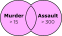

```{r setup, purl=FALSE}
#| include: false
options(width = 68)
knitr::opts_chunk$set(eval=TRUE, echo=TRUE, message=TRUE, warning=TRUE, dev = "svg")
```


# Things to include

* Distributions
   * Mean vs. median and skew
      * Logs and log-normals
   * Histograms
   * Barplots?
   * Densities
   * Tables for categoricals
   * skimr?

* Relationships
  * Mean differences between groups
     * Demonstrate conditional distributions
  * Crosstabs
  * Correlations

---

# Today

* News items:
   * Two assessments
      * *Light* data analysis and interpretation
      * One week to complete
   * [Jing's Office Hours](https://us05web.zoom.us/j/84826817691?pwd=cjFnQjBJY1BkOUxvRnBrQy9KbExNQT09): Friday, 12:30-13:30
      * Also by appointment
   * Reschedule Nov 16th to Monday Nov 14th
     * Tentative: 4 PM

--

* Programming

   * Logical expressions
   * `dplyr`

* Statistics

   * Distributions
   * Associations

---
class: inverse

# Logical Expressions

&nbsp;

&nbsp;


---

# Indexing

Last week we subset or indexed data like so:

```{r}
USArrests[c("California", "Arkansas"), 2:3]
```

This is indexing by **name** or **position**

---

# Indexing by Expression

We can also index using expressions—logical *tests*.

```{r}
USArrests[USArrests$Murder > 15, ]
```

--

What does this give us?


---

# How Expressions Work

What does `USArrests$Murder > 15` actually do? 

--

```{r}
USArrests$Murder > 15
```

--

It returns a vector of `TRUE` or `FALSE` values.

When used with the subset operator (`[]`), elements for which a `TRUE` is given are returned while those corresponding to `FALSE` are dropped.

--

```{r}
c(1,2,3,4)[c(TRUE, FALSE, TRUE, FALSE)]
```


---

# Logical Operators

We used `>` for testing "greater than": `USArrests$Murder > 15`.

--

There are many other [logical operators](http://www.statmethods.net/management/operators.html):

--
* `==`: equal to

--
* `!=`: not equal to

--
* `>`, `>=`, `<`, `<=`: less than, less than or equal to, etc.

--
* `%in%`: used with checking equal to one of several values

--

Or we can combine multiple logical conditions:

* `&`: both conditions need to hold (AND)
--

* `|`: at least one condition needs to hold (OR)
--

* `!`: inverts a logical condition (`TRUE` becomes `FALSE`, `FALSE` becomes `TRUE`)

--

Logical operators are one of the foundations of programming. You should experiment with these to become familiar with how they work!

---

# And: `&`


```{r}
USArrests[USArrests$Murder > 15 & USArrests$Assault > 300, ]
```


---

# Or: `|`



```{r}
USArrests[USArrests$Murder > 15 | USArrests$Assault > 300, ]
```


---

# Sidenote: Missing Values

Missing values are coded as `NA` entries without quotes:

```{r}
vector_w_missing <- c(1, 2, NA, 4, 5, 6, NA)
```

--

Even one `NA` "poisons the well": You'll get `NA` out of your calculations unless you remove them manually or use the extra argument `na.rm = TRUE` in some functions:

```{r}
mean(vector_w_missing)
```

--

We can take missings (`NA`) and remove (`rm`) them:

```{r}
mean(vector_w_missing, na.rm=TRUE)
```

---
# Finding Missing Values

**WARNING:** You can't test for missing values by seeing if they "equal" (`==`) `NA`:

```{r}
vector_w_missing == NA
```

--

But you can use the `is.na()` function:

```{r}
is.na(vector_w_missing)
```

--

We can use subsetting to get the equivalent of `na.rm=TRUE`:

```{r}
mean(vector_w_missing[!is.na(vector_w_missing)]) #<<
```


.footnote[
`!` *reverses* a logical condition. Read the above as "subset to *not* `NA`"
]

---
class: inverse

# `tidyverse`

&nbsp;


---

# Installing `tidyverse`

We're going to practice loading files and manipulating data.

--

We will use a packages called `readr` and `dplyr` to do this neatly.

These packages are part of the [`tidyverse`](http://tidyverse.org/) family of R packages

* These packages make using R *much easier*

--

If you have not already installed the tidyverse, type, in the console: `install.packages("tidyverse")`

--

This will install a *large* number of R packages we will use throughout the term, including `readr` and `dplyr`.

---

# Loading Packages

```{r}
library(readr)
library(dplyr)
```

---

# Wait, was that an error?

When you load packages in R that have functions sharing the same name as functions you already have, the more recently loaded functions overwrite the previous ones ("masks them").

--

This **message** is just letting you know that.

--

Sometimes you may get a **warning message** when loading packages---usually because you aren't running the latest version of R:

```
Warning message:
package `dplyr' was built under R version 4.2.2
```

*Update R* to get rid of these!

---
class: inverse
# Importing and Exporting Data

&nbsp;


---

# Working Directories

Recall that R saves files and looks for files to open in your current **working directory**. 

You can find out what it is using the function `getwd()`.

On my computer when I knitted these slides, it happened to be:

```{r}
getwd()
```

---
# `setwd()`

You can use `setwd(dir = "C:/path/to/new/working/directory")` to change the working directory.

Working directory suggestions:

* Instead of setting a working directory, it is usually better to use [RStudio projects](https://support.rstudio.com/hc/en-us/articles/200526207-Using-Projects) to manage working directories.

--

* Windows users: If you copy a path from Explorer, make sure to change back slashes (`\`) to forward slashes (`/`) for the filepaths

--

* If you *need* to set a working, put `setwd()` at the start of your file

---

# Projects in RStudio

A better way to deal with working directories: RStudio's **project** feature in the top-right dropdown. This has lots of advantages:

--

* Sets your working directory to be the project directory.

--

* Remembers objects in your workspace, command history, etc. next time you re-open that project.

--

* Reduces risk of intermingling different work using the same variable names (e.g. `n`) by using separate RStudio instances for each project.


---

# Delimited Text Files

One of the most common ways for data to be stored is in a *delimited* text file, e.g. comma-separated values (**.csv**) or tab-separated values (**.tsv**). Here is **.csv** data:

```
"Id","Offense","Sex","Month"
101,"Battery","Male",1,
101,"Battery","Male",1,
101,"Robbery","Male",1,
101,"Battery","Male",2,
101,"Robbery","Male",2,
101,"Homicide","Male",3,
103,"Robbery","Female",1,
103,"Robbery","Female",3,
103,"Battery","Female",4,
```

---
# `readr`

R has a variety of built-in functions for importing delimited text, like `read.table()` and `read.csv()`.

I recommend using the versions in the `readr` package instead: `read_csv()`, `read_tsv()`, and `read_delim()`:

`readr` function features:

* Faster!
* A *little* smarter about dates and times
* Handy function `problems()` you can run if there are errors
* Loading bars for large files

---

# `readr` Importing Example

Let's use `read_csv()` from `readr` to import some data about fatal police shootings from Kaplan (2022).

.small[
```{r}
shootings <- 
  read_csv( 
    "https://clanfear.github.io/ioc_iqa/_data/fatal-police-shootings-data.csv"
    )
```
]

---
class: inverse

# `dplyr`

&nbsp;


---

# Check Out Shootings

`dplyr` gives us access to the handy `glimpse()` for inspecting dataframes.

.text-62[
```{r}

glimpse(shootings)
```
]

---

# But first, pipes!

We can use pipe operators (`|>`) to send data between functions. So instead of nesting functions like this:

```{r}
sort(table(shootings$race))
```

--

We can pipe them like this:

```{r}
shootings$race |> table() |> sort()
```

--

Read this as, "get `shootings$race`, and then make a `table()`, and then `sort()` it."
In essence, pipes read "left to right" while nested functions read "inside to out."

---

# `filter` Data Frames

```{r}
shootings |> filter(armed == "unarmed") |> head()
```

.text-center[
*What is this doing?*
]

.footnote[
Note that `dplyr` hides excess columns from output so it fits the console!
]

---

# `filter`

`filter()` is `dplyr`'s function for indexing **rows** of a dataframe

--

It takes *only* logical vectors (the result of **expressions**) as an argument

--

If you want to `filter()` by *position*, use `slice()`:

```{r}
shootings |> slice(c(1, 5, 9))
```


---
# Multiple Conditions

.pull-left[

### And: `&`

```{r, eval=FALSE}
shootings |>
    filter(armed == "unarmed" & 
             age < 18)
```

.image-100[

]

*Give me rows where the subject was unarmed **and** their age is under 18.*

]

--

.pull-right[

### Or: `|`

```{r, eval=FALSE}
shootings |>
    filter(armed == "unarmed" |
          age < 18)
```

.image-100[

]

*Give me rows where the subject was unarmed **or** their age is under 18... or **both**.*

]


---
class: inverse

# Plotting


---

# London Crime

Let's load another example dataset: 

Metropolitan Police recorded crime in London boroughs in 2021

```{r}
metro_2021 <- read_csv("https://clanfear.github.io/ioc_iqa/_data/metro_2021.csv")
```

---

# London Crime


```{r}
glimpse(metro_2021)
```

---

# Saving a Subset

If we think a particular subset will be used repeatedly, we can save it and give it a name like any other object:

```{r}
westminster <- metro_2021 |> filter(borough == "Westminster")
head(westminster, 4)
```

---

## Base R Plots from Last Week

.pull-left[
 .small[
```{r base-plot, fig.show='hide'}
plot(robbery ~ month, 
     data = westminster, 
     xlab = "Month", 
     ylab = "Robbery",
     main = "Robbery in Westminster in 2021", 
     col = "red", 
     cex.lab = 1.5,
     cex.main= 1.5,
     pch = 16)
```
 ]
]

.pull-right[
```{r base-plot-out, ref.label = "base-plot", echo=FALSE}
```
]

