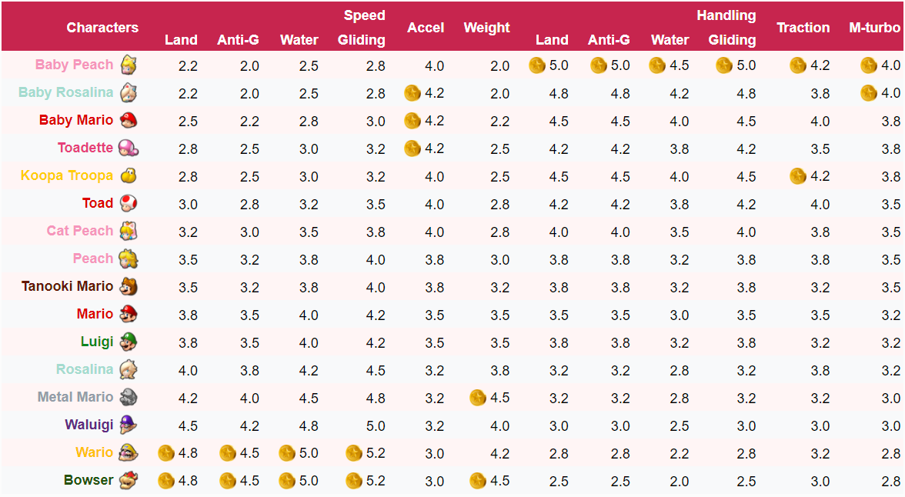

```{r setup, purl=FALSE}
#| include: false
options(width = 68)
knitr::opts_chunk$set(eval=TRUE, echo=TRUE, message=TRUE, warning=TRUE, dev = "svg")
```


# Today

* Code
   * `ggplot2`
   * More tables
   * `{broom}` for model output

* Stats
   * Chi-square test
   * Simple OLS regression

---
class: inverse

# Some Review

---

# London Crime

Let's load another example dataset: 

Real Metropolitan Police recorded crime in the 32 London boroughs (no City of London) in 2021

```{r, message = FALSE, warning = FALSE}
library(tidyverse)
metro_2021 <- 
  read_csv("https://clanfear.github.io/ioc_iqa/_data/metro_2021.csv")
```

I obtained these from `data.police.uk`—it is easy to get your own for nearly anywhere in the UK, and in any recent period.

I also linked them to data on deprivation and subregions, which would take more work!

---

# London Crime


```{r}
glimpse(metro_2021)
```

---

# `distinct()`

These data have monthly observations for each borough.

If we wanted to look at only unique observations of boroughs, we can use `distinct()`

```{r}
metro_2021 |> 
  distinct(borough) |>
  head()
```

---

# `summarize()`

Just as a quick check, let's see how many boroughs and months are in the data

```{r}
metro_2021 |> 
  summarize(n_boroughs  = n_distinct(borough),
            n_months    = n_distinct(month),
            sample_size = n())
```

Looks like every borough is seen in 12 months

```{r}
32 * 12
```

---

# Another Check

A different way to see if all boroughs are observed 12 times is to count observations of each borough twice

```{r}
metro_2021 |> count(borough) |> head(3)
```

--

Okay, then count how many of each value of `n`

```{r, warning = FALSE, message = FALSE}
metro_2021 |> count(borough) |> count(n) # This makes a warning! #<< 
```

Every value of `n` was 12, so there were 32 values of 12.

---

# Saving a Subset

If we think a particular subset will be used repeatedly, we can save it and give it a name like any other object:

```{r}
westminster <- metro_2021 |> filter(borough == "Westminster")
head(westminster, 4)
```

--

.text-center[
*And now for something completely different*
]

---
class: inverse

# Plotting


---

## Base R Plots from 2 Weeks Ago

.pull-left[
```{r base-plot, fig.show='hide'}
plot(robbery ~ month, 
     data = westminster, 
     xlab = "Month", 
     ylab = "Robbery",
     main = 
       "Robbery in Westminster", 
     col = "red", 
     cex.lab = 1.5,
     cex.main= 1.5,
     pch = 16)
```
]

.pull-right[
`)
]

---

# `ggplot2`
  
An alternative way of plotting many prefer (myself included) uses the `ggplot2` package in R, which is part of the `tidyverse`.


```{r}
library(ggplot2)
```

The core idea underlying this package is the [**layered grammar of graphics**](https://doi.org/10.1198/jcgs.2009.07098): we can break up elements of a plot into pieces and combine them.

---

## Robberies in `ggplot`
  
.pull-left[
```{r westminster-gg,  fig.show='hide'}
ggplot(data = westminster, 
        aes(x = month, 
            y = robbery)) +
  geom_point()
```
]

.pull-right[
`)
]

.footnote[
*Weird syntax and an ugly plot—what's going on here?*
]

---

# Structure of a ggplot
  
`ggplot2` graphics objects consist of two primary components:
  
--
  
**Layers**, the components of a graph.

* We *add* layers to a `ggplot2` object using `+`.
* This includes lines, shapes, and text.

--
  
**Aesthetics**, which determine how the layers appear.

* We *set* aesthetics using *arguments* (e.g. `color="red"`) inside layer functions.
* This includes locations, colors, and sizes.
* Aesthetics also determine how data *map* to appearances.

---
  
# Layers
  
**Layers** are the components of the graph, such as:
  
* `ggplot()`: The initial plot canvas
* `geom_point()`: Scatterplot points
* `geom_line()`: Lines between data points
* `labs()`: Plot title and axis labels
* `facet_wrap()`: Divides plot into a sequence of panels
* `facet_grid()`: Divides plot into a grid of plot panels
* `theme_bw()`: Replace default gray background with black-and-white

Layers are separated by a `+` sign.

---
  
# Aesthetics
  
**Aesthetics** control the appearance of the layers:
  
* `x`, `y`: $x$ and $y$ coordinate values to use
* `color`: Color of elements based on some data value
* `group`: Describe which data points are grouped together (often used with lines)
* `size`: Size of points/lines based on some data value
* `alpha`: Transparency based on some data value

---
  
## Aesthetics: Setting vs. mapping
  
Layers take arguments to control their appearance, such as point/line colors or transparency (`alpha` between 0 and 1).

--
  
* Arguments like `color`, `size`, and `fill` can be used directly on layers (**setting aesthetics**), e.g. `geom_point(color = "red")`. These *don't depend on the data*.

--

* Arguments inside `aes()` (**mapping aesthetics**) will *depend on the data*, e.g. `geom_point(aes(color = continent))`.

--

* `aes()` in the `ggplot()` layer gives overall aesthetics to use in other layers, but can be changed on individual layers (including switching `x` or `y` to different variables)

--

This may seem pedantic, but precise language makes searching for help easier.

--

Now let's see all this jargon in action.

---

# Westminster Robbery

### 1: Base Plot

.pull-left[
.text-85[
```{r westminster-1, fig.show='hide'}
ggplot(data  = westminster,  #<<
       aes(x = month, #<<
           y = robbery)) #<<
```
]
]
.pull-right[
`)
]

.footnote[Initialize the plot with `ggplot()` and `x` and `y` aesthetics **mapped** to variables.]

---

# Westminster Robbery

### 2: Scatterplot

.pull-left[
.text-85[
```{r westminster-2, fig.show='hide'}
ggplot(data  = westminster, 
       aes(x = month, 
           y = robbery)) +
  geom_point() #<<
```
]
]
.pull-right[
`)
]

.footnote[Add a scatterplot **layer**]

---

# Westminster Robbery

### 3: Point Color and Size

.pull-left[
.text-85[
```{r westminster-3, fig.show='hide'}
ggplot(data  = westminster, 
       aes(x = month, 
           y = robbery)) +
  geom_point(color = "red", 
             size  = 3) #<<
```
]
]
.pull-right[
`)
]

.footnote[**Set** aesthetics to make the points large and red]

---

# Westminster Robbery

### 4: X-Axis Label

.pull-left[
.text-85[
```{r westminster-4, fig.show='hide'}
ggplot(data  = westminster, 
       aes(x = month, 
           y = robbery)) +
  geom_point(color = "red", 
             size  = 3) +
  labs(x = "Month") #<<
```
]
]
.pull-right[
`)
]

.footnote[Add a label layer to capitalize the x-axis label]

---

# Westminster Robbery

### 5: Y-Axis Label

.pull-left[
.text-85[
```{r westminster-5, fig.show='hide'}
ggplot(data  = westminster, 
       aes(x = month, 
           y = robbery)) +
  geom_point(color = "red", 
             size  = 3) +
  labs(x = "Month",
       y = "Robbery") #<<
```
]
]
.pull-right[
`)
]

.footnote[Add text to clean up the y-axis label]

---

# Westminster Robbery

### 6: Title

.pull-left[
.text-85[
```{r westminster-6, fig.show='hide'}
ggplot(data  = westminster, 
       aes(x = month, 
           y = robbery)) +
  geom_point(color = "red",
             size  = 3) +
  labs(x = "Month",
       y = "Robbery",
       title = 
        "Robbery in Westminster") #<<
```
]
]
.pull-right[
`)
]

.footnote[Add a title]

---

# Westminster Robbery

### 7: Theme

.pull-left[
.text-85[
```{r westminster-7, fig.show='hide'}
ggplot(data  = westminster, 
       aes(x = month, 
           y = robbery)) +
  geom_point(color = "red", 
             size  = 3) +
  labs(x = "Month",
       y = "Robbery",
       title = 
        "Robbery in Westminster") +
  theme_bw() #<<
```
]
]
.pull-right[
`)
]

.footnote[Pick a basic theme with a new layer]

---

# Westminster Robbery

### 8: Text Size

.pull-left[
.text-85[
```{r westminster-8, fig.show='hide'}
ggplot(data  = westminster, 
       aes(x = month, 
           y = robbery)) +
  geom_point(color = "red", 
             size  = 3) +
  labs(x = "Month",
       y = "Robbery",
       title = 
        "Robbery in Westminster") +
  theme_bw(base_size = 18) #<<
```
]
]
.pull-right[
`)
]

.footnote[Increase the base text size]

---

# Plotting All Boroughs
  
We have a plot we like for Westminster... 

... but what if we want *all the boroughs*?
  
---

# Plotting All Boroughs

### 1: A Mess!

.pull-left[
.text-85[
```{r london-1, fig.show='hide'}
 ggplot(data  = metro_2021, 
        aes(x = month, 
            y = robbery)) +
  geom_point(color = "red", 
             size = 3) +
  labs(x     = "Month",
       y     = "Robbery",
       title = 
         "Robbery in London") +
  theme_bw(base_size = 18)
```
]
]
.pull-right[
`)
]

.footnote[We can't tell boroughs apart! Maybe we could follow *lines*?]

---


# Plotting All Boroughs

### 2: Lines

.pull-left[
.text-85[
```{r london-2,  fig.show='hide'}
 ggplot(data  = metro_2021, 
        aes(x = month, 
            y = robbery)) +
  geom_line(color = "red", 
            linewidth  = 3) + #<<
  labs(x     = "Month",
       y     = "Robbery",
       title = 
         "Robbery in London") +
  theme_bw(base_size = 18)
```
]
]
.pull-right[
`)
]

.footnote[`ggplot2` doesn't know how to connect the lines!]

---

# Plotting All Boroughs

### 3: Grouping

.pull-left[
.text-85[
```{r london-3, fig.show='hide'}
 ggplot(data  = metro_2021, 
        aes(x = month, 
            y = robbery, 
            group = borough)) +
  geom_line(color = "red", 
            linewidth  = 3) + 
  labs(x     = "Month",
       y     = "Robbery",
       title = 
         "Robbery in London")+
  theme_bw(base_size = 18)
```
]
]
.pull-right[
`)
]

.footnote[That looks more reasonable... but the lines are too thick!]

---

# Plotting All Boroughs

### 4: Size
.pull-left[
.text-85[
```{r london-4, fig.show='hide'}
 ggplot(data  = metro_2021, 
        aes(x = month, 
            y = robbery, 
            group = borough)) +
  geom_line(color = "red") + #<<
  labs(x     = "Month",
       y     = "Robbery",
       title = 
         "Robbery in London") +
  theme_bw(base_size = 18)
```
]
]
.pull-right[
`)
]

.footnote[Much better... but maybe we can do highlight subregions?]

---
  
  
# Plotting All Boroughs
  
### 5: Color

.pull-left[
.text-85[
```{r london-5,  fig.show='hide'}
 ggplot(data  = metro_2021, 
        aes(x = month, 
            y = robbery, 
            group = borough, 
            color = subregion)) + #<<
  geom_line() + 
  labs(x     = "Month",
       y     = "Robbery",
       title = 
         "Robbery in London") +
  theme_bw(base_size = 18)
```
]
]
.pull-right[
`)
]

.footnote[Hmmm, hard to make out... why not separate subregions completely?]

---

# Plotting All Boroughs
  
### 6: Facets

.pull-left[
.text-85[
```{r london-6, fig.show='hide'}
 ggplot(data  = metro_2021, 
        aes(x = month, 
            y = robbery, 
            group = borough, 
            color = subregion)) +
  geom_line() + 
  facet_wrap(~subregion) + #<<
  labs(x     = "Month",
       y     = "Robbery",
       title = 
         "Robbery in London")+
  theme_bw(base_size = 18)
```
]
]
.pull-right[
`)
]

.footnote[Looking good, but the legend is redundant!]

---

# Plotting All Boroughs
  
### 7: Legend

.pull-left[
.text-85[
```{r london-7, fig.show='hide'}
 ggplot(data  = metro_2021, 
        aes(x = month, 
            y = robbery, 
            group = borough, 
            color = subregion)) +
  geom_line() + 
  facet_wrap(~subregion) +
  labs(x     = "Month",
       y     = "Robbery",
       title = 
         "Robbery in London") +
  theme_bw(base_size = 18) +
  theme(legend.position = "none") #<<
```
]
]
.pull-right[
`)
]

.footnote[The x-axis labels are overlapping!]

---

# Plotting All Boroughs
  
### 8: Axis Labels

.pull-left[
.text-85[
```{r london-8, fig.show='hide'}
 ggplot(data  = metro_2021, 
        aes(x = month, 
            y = robbery, 
            group = borough, 
            color = subregion)) +
  geom_line() + 
  scale_x_date(date_labels = "%b") + #<<
  facet_wrap(~subregion) +
  labs(x     = "Month",
       y     = "Robbery",
       title = 
         "Robbery in London") +
  theme_bw(base_size = 18) +
  theme(legend.position = "none")
```

You can look at the help file `?strptime` to find these `%` codes for date formatting
]
]
.pull-right[
`)
]

.footnote[Not bad!]

---

# Enough for now

.pull-left-60[
Don't worry about understanding it all now—it is complicated!

... but it is worth learning because it can produce publication ready plots

We'll return to `ggplot2` at least for a bit in every future lecture
]

.pull-right-40[

]

.footnote[
.pull-left[
&zwj;Source: [Lanfear et al. (2023) "Inequalities in Exposure to Firearm Violence by Race, Sex, and Birth Cohort From Childhood to Age 40 Years, 1995-2021"](https://jamanetwork.com/journals/jamanetworkopen/fullarticle/2804655)
]
]

---
background-color: white

# Bonus map

&nbsp;


.footnote[
&zwj;Source: [Lanfear & Kirk (2024) "The Promise and Perils of the Sharing Economy: The Impact of Airbnb Lettings on Crime"](https://doi.org/10.1111/1745-9125.12383)
]

---
class: inverse

# Book Recommendation

.pull-left[

]
.pull-right[
* Targeted at social scientists without technical backgrounds

* Teaches good visualization principles

* Uses R, `ggplot2`, and `tidyverse`

* Free online version:

   * [https://socviz.co/](https://socviz.co/)

* Affordable in print
]

---
class: inverse

# Statistical Inference


```{r, cache = TRUE, message = FALSE, echo = FALSE, eval = FALSE, warning = FALSE}
library(gganimate)
library(ggforce)

samples <- rnorm(100)
index <- seq(1:length(samples))
df <- tibble(value = samples, index = index)

bin_width <- 0.25

count_data <- # some minor data transformation
  df %>%
  mutate(x = plyr::round_any(value, bin_width)) %>%
  group_by(x) %>%
  mutate(y = seq_along(x))

plot2 <- 
  ggplot(count_data) +
  geom_ellipse(aes(group = index, x0 = x, y0 = y, a = bin_width/2, b = 0.5, angle = 0), fill = '#f0f1eb', color = NA) +
  coord_equal(bin_width, expand = FALSE)  +# to make the dots look nice and round
  theme_void() +
  theme(plot.background = element_rect(fill = "transparent", color = "transparent"))

p_anim2 <- 
  plot2 +
  transition_states(states = index, transition_length = 100, state_length = 1) +
  shadow_mark() +
  enter_fly(y_loc = 15) 

balldrop <- animate(p_anim2, fps = 60, duration = 10, bg = 'transparent', width = 1024, height = 1024)
anim_save("img/balldrop.gif", balldrop)
```


---

# `communities` Data

Let's return to the `communities` data we've used before—making sure to fix the ordinal variables again

.text-85[
```{r, message = FALSE}
communities <- 
  read_csv("https://clanfear.github.io/ioc_iqa/_data/communities.csv") |> 
  mutate(disadvantage = 
           factor(disadvantage, levels = c("Low", "Medium", "High")), 
         incarceration = 
           factor(incarceration, levels = c("Low", "Medium", "High")))
glimpse(communities)
```

]

---

# Cross-Tab

Say we tabulate our data and see this association in our sample:

```{r, message = FALSE, warning = FALSE}
library(janitor) # For the tabyl function
communities |> tabyl(disadvantage, area) |> adorn_title()
```


It looks like disadvantage has different patterns in rural and urban areas

--

We want to know if there's a real relationship in the population

How do we figure this out?

---

# Chi-square Test

`janitor` adds a `chisq.test()` function that works on its special tables

```{r}
communities |> tabyl(disadvantage, area) |> chisq.test()
```

--

This is the same result we saw in CRM yesterday: There appears to be an association.

--

If you're curious how p-values are calculated, they come from cumulative probability distributions—which R has built in!

```{r}
1 - pchisq(9.1153, df = 2)
```

.pull-right[
.footnote[We'll mess with this a bit more another day!]
]

---
## How unlikely is that?

.pull-left[
.text-85[
```{r chisq-1, fig.show='hide'}
tibble(x = seq(0, 15, 0.1),
       density = dchisq(x, df = 2)) |> 
  ggplot(aes(x = x, y = density)) + 
  geom_line() +
  coord_cartesian(expand = FALSE) +
  geom_vline(xintercept = 9.1153, 
             color = "red")
```

]
]
.pull-right[
`)
]

That is really unlikely to occur by chance:

*If there were no real association in the population, only 1.04% of all possible random samples would have an association this strong*

---

# A Prettier Table

There are many ways to make nicer looking tables in R

For very simple tables using dataframes, I use `kable()` in `{knitr}`

```{r, message = FALSE, warning = FALSE}
communities |> 
  tabyl(disadvantage, area) |> 
  adorn_title() |> 
  knitr::kable() # Access a package function without loading it #<<
```

.footnote[
Yours won't have the colored rows—that's from my website theme!
]

---

# More Complex

If you want to make a publication ready table that will work in any output format, such as PDF, Word, or HTML, [your best bet is `{flextable}`](https://ardata-fr.github.io/flextable-book/)

```{r, warning = FALSE, message = FALSE}
library(flextable)
communities |> 
  rename(Disadvantage = disadvantage) |>
  tabyl(Disadvantage, area) |>
  flextable() |>
  add_header_lines("Table 1. Disadvantage by area")
```

It can be complicated, but it can do just about anything...

---

# `{flextable}` is... flexible



.footnote[Source: [Flextable Gallery](https://www.ardata.fr/en/flextable-gallery/2021-01-12-mario-kart/)]

---

### I suppose you can use it for articles too


.footnote[Source: [Lanfear (2022) "Collective efficacy and the built environment"](https://doi.org/10.1111/1745-9125.12304)]

---

# Bar Plots

Aside from tables, you may want to plot categorical data


.pull-left[
```{r barplot-1, fig.show='hide'}
ggplot(communities, 
       aes(x = disadvantage)) + 
  geom_bar()
```

`geom_bar()` tabulates counts of values of categorical variables and makes a bar plot

]
.pull-right[
`)
]

---

# Filled Bar Plots

Adding a `fill` aesthetic will color the bars by a second variable

.pull-left[
```{r barplot-2, fig.show='hide'}
ggplot(communities, 
       aes(x    = disadvantage,
           fill = area)) + 
  geom_bar()
```
]
.pull-right[
`)
]

---

# Dodgy Bar Plots

Adding `position = "dodge"` in `geom_bar()` will unstack them

.pull-left[
```{r barplot-3, fig.show='hide'}
ggplot(communities, 
       aes(x    = disadvantage,
           fill = area)) + 
  geom_bar(position = "dodge")
```
]
.pull-right[
`)
]

---
class: inverse

# Linear Regression

<video controls autoplay>
    <source src="img/parks-rec-webm.mp4" type="video/mp4">
</video>


.footnote[Credit: [Edmund Helmur](https://twitter.com/theotheredmund/status/1349453230762196992?s=20&t=bBDscDYt2was9ABePCcZhQ)]

---

# `lm()`

We can run an OLS linear model in R using `lm()`

--

It takes a **formula** as the first argument, e.g. `y ~ x`

```{r}
cr_pd_lm <- lm(crime_rate ~ pop_density, data = communities)
cr_pd_lm
```

By default, it won't produce much output—you probably wanted significance tests!

---

# `summary()`

To get detailed output, use `summary()` on the output from `lm()`

.text-85[
```{r}
summary(cr_pd_lm)
```
]

---

# `lm()` Output is a List


`lm()` produces a lot more information than what is shown by `summary()` however. We can see the structure of `lm()` output using `str()`:

.text-85[
```{r}
str(cr_pd_lm, list.len=6) # Truncating the output a bit
```
]

`lm()` actually has an enormous quantity of output! This is a type of object called a list.

---

# Digging Into a List

We can access parts of lm() output using $ like with dataframe names:

```{R}
cr_pd_lm$coefficients
```

We can also do this with summary(), which provides additional statistics:

```{r}
summary(cr_pd_lm)$coefficients
```

---

# `broom::tidy()`

A quick way to get model output into an easy-to-use format is with the `{broom}` package's `tidy()` function

```{r}
library(broom)
tidy(cr_pd_lm)
```
--

`tidy()` turns model output into a dataframe—now you can use `dplyr` with it!

```{r}
tidy(cr_pd_lm) %>% filter(term == "pop_density")
```

---

# `broom::augment()`

`{broom}` can also add regression results back to your original data using `augment()`

This includes **predicted values** and **residuals**

```{r}
cr_pd_lm |> augment() |> glimpse()
```

We'll use this later to do model diagnostics!

---

# Plotting Regression Lines

`geom_smooth()` is used to add conditional mean lines to plots—the regression line is just one type of these!

.pull-left[
.text-85[
```{r comm-lm, fig.show='hide'}
communities %>%
  ggplot(aes(x = pop_density, 
             y = crime_rate)) + 
  geom_point(alpha = 0.5) +
  labs(x = "Population Density", 
       y = "Crime Rate") +
  geom_smooth(method  = "lm", 
              formula = "y ~ x") +
  theme_minimal(base_size = 16)
```

By default it includes a confidence interval along the line

This is the CI for the mean *at each level of `x`*

]
]
.pull-right[
`)
]

---

# More Lines

If you group your data, you can draw a regression line for each separately—equivalent to running a separate model on each group

.pull-left[
.text-85[
```{r comm-lm-area, fig.show='hide'}
communities %>%
  ggplot(aes(x = pop_density, 
             y = crime_rate,
             group = area,
             color = area)) + 
  geom_point(alpha = 0.5) +
  labs(x = "Population Density", 
       y = "Crime Rate",
       color = "Area") +
  geom_smooth(method  = "lm", 
              formula = "y ~ x") +
  theme_minimal(base_size = 16)
```
]
]
.pull-right[
`)
]

---
class: inverse

# Wrap-Up

* That was a lot this week!

   * Take the week off on this course—focus on CRM and your other courses

* Next week will have an assignment handed out

* Most of the rest of the course is figuring out how to apply all this

   * Plus learning some more programming tools!