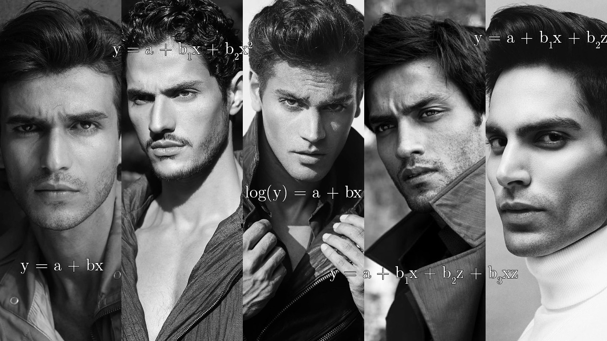

```{r setup, purl=FALSE}
#| include: false
options(width = 68)
set.seed(7)
knitr::opts_chunk$set(eval=TRUE, echo=TRUE, message=FALSE, warning=FALSE, dev = "svg", fig.height = 4)
```


# Today

## Making Predictions

## Comparing Models

---

# Setup

Like usual, let's start by loading the communities data and converting our categorical variables to factors with appropriate levels

.text-85[
```{r, message = FALSE, warning = FALSE}
library(tidyverse)
library(broom) 
communities <- 
  read_csv("https://clanfear.github.io/ioc_iqa/_data/communities.csv") |>
  mutate(across(c(incarceration, disadvantage), 
                ~ factor(., levels = c("Low", "Medium", "High"))))
```
]

Again, we'll use `tidyverse` and `broom` today.

---
class: inverse

# Two small asides

&nbsp;

&nbsp;

.pull-left[

]
.pull-right[

]

---

# Help Files and Methods

Remember you can get help with a function using `?`:

```{r, eval = FALSE}
?tidy
```

--

Some functions, like `tidy()`, work differently when you give them different types of **arguments**.

--

These different ways of working are called **methods**—and they're secretly *different functions*

--

If you give `tidy()` output from `lm()` it actually runs `tidy.lm()`!

```{r, eval = FALSE}
?tidy.lm # tidy() method for lm objects
```

--

`summary()` works this way too:

```{r, eval = FALSE}
?summary.lm # summary method for lm objects
```

--

This is good to know when looking for help

---

# Dagitty


Let's say we have a DAG and we're not sure if we can identify the effect of $Z$ on $Y$

```{tikz sim-dag, fig.width = 2.75, cache = TRUE, purl = FALSE, echo = FALSE}
\usetikzlibrary{positioning}
\definecolor{black}{HTML}{000000}
\tikzset{
    > = stealth,
    every node/.append style = {
        draw = none,
        scale = 3
    },
    every path/.append style = {
        arrows = ->,
        draw = black,
        fill = none,
        scale = 1,
        line width = 1.5mm
    },
    hidden/.style = {
        draw = black,
        shape = circle,
        inner sep = 1pt
    }
}
\tikz{
  \node (Y) at (0, 5) {$Y$};
  \node (D) at (5, 0) {$D$};
  \node (Z) at (5, 5) {$Z$};
  \node (E) at (0, 0) {$E$};
  \path (Z) edge (Y);
  \path (D) edge (Y);
  \path (E) edge (Y);
  \path (E) edge (Z);
  \path (D) edge (Z);
  \path (E) edge (D);
  }
```

--

&nbsp;

We could do it all by hand, writing down the paths and thinking it out. 

--

But thinking hurts brain, so instead we could also use [`dagitty` (http://www.dagitty.net/dags.html)](http://www.dagitty.net/dags.html) to determine if we can identify an effect.

It can be a little finicky, but it works *really* well—and is a great learning tool!

---
class: inverse

# Prediction


---

# Fitted Values

A regression model's predictions for each unit are called **fitted values**

--

These are the $Y$ values on the regression line given each unit's predictors 

--

.pull-left[
```{r}
lm(crime_rate ~ pop_density,
   data = communities) |>
  augment() |> # add .fitted #<<
  slice(1) |> # first row #<<
  select(.fitted, pop_density)
```
]
.pull-right[
```{r, echo=FALSE, fig.height = 5}
ggplot(communities,
       aes(x = pop_density, 
           y = crime_rate)) +
  geom_point() +
  geom_smooth(method = "lm") +
  theme_minimal() + 
  geom_hline(yintercept = 35.43, color = "red") +
  geom_vline(xintercept = 18.17, color = "red")
```
]

Two tricks here:

* `augment()` returns the original data with a new `.fitted` column
* `slice(1L)` is `filter()` using *row numbers* (e.g., give me only the *first row*)


---

# Getting Fitted Values

We can get **fitted values** using `fitted()` or `broom::augment()`

```{r}
ex_lm <- lm(crime_rate ~ pop_density + disadvantage, 
            data = communities)
fitted(ex_lm) |> head(4) # Returns them as a vector
```

--

```{r}
augment(ex_lm) |> head(4) # Returns them added to original data
```


---

# Where They Come From

.pull-left[
```{r}
ex_lm |> # getting coefficients
  tidy() |>
  select(term, estimate)
```
]

.pull-right[
```{r}
communities[1, c(2, 4)]
fitted(ex_lm)[1]
```
]

--

Our regression formula:

$$\hat{y} = -22.1 + \color{#003C71}{3.02*PopDen} + \color{#8A1538}{1.44*DisMed} + \color{#880088}{5.52*DisHigh}$$
--

Multiplying through:

$$32.87 = -22.1 + \color{#003C71}{3.02*18.2} + \color{#8A1538}{1.44*0} + \color{#880088}{5.52*0}$$

---

# Counterfactual Values

Sometimes we want to make a prediction using a set of **counterfactual** values—values we choose rather than from a real observation

--

We can do this using the equation:

$$\hat{y} = -22.1 + \color{#003C71}{3.02*PopDen} + \color{#8A1538}{1.44*DisMed} + \color{#880088}{5.52*DisHigh}$$
--

What is our prediction for the average crime rate in a high disadvantage place with 10 population density?

--

Plug in, multiply through:

$$13.62 = -22.1 + \color{#003C71}{3.02*10} + \color{#8A1538}{1.44*0} + \color{#880088}{5.52*1}$$
--

We can do this with `predict()` and the `newdata =` argument:

```{r}
predict(ex_lm, newdata = data.frame(pop_density = 10, 
                                    disadvantage = "High"))
```

.pull-right[
.footnote[
Only different due to rounding!
]
]

---

# Interpreting Intercepts

This highlights what the intercept means:

$$-22.1 = -22.1 + 3.02*0 + 1.44*0 + 5.52*0$$
The expected crime rate for an area with *0 population density* and *low disadvantage* (i.e., not medium and not high)

--

```{r}
predict(ex_lm, newdata = data.frame(pop_density = 0, 
                                    disadvantage = "Low"))
```

--

The intercept alone is often not a useful parameter to interpret

Crime rates can't be *negative*!

--

```{r}
communities |> pull(pop_density) |> min()
```

.pull-right[
.footnote[
There aren't even any areas near 0!
]
]

---
class: inverse

# Comparing Models

&nbsp;



---

# Specification

How you set a model up is called the model's **specification**

--

It includes:

* The variables you include in your statistical model

   * DAGs (and theory) help us with this!
   * We'll mess with this today

--

* The functional forms of those variables

   * DAGs don't help us with this (but theory can)
   * We'll mess with functional forms *next week*

--

There are two tools to help us with this:

--

* **Fit statistics**: Numbers that indicate how well a model fits the data

--

* **Specification tests**: Hypothesis tests to check if our model gets "better" (or "worse") when we make changes

--

.text-center[
*So what does it mean to be better or worse? Or to fit well?*
]

---

# $R^2$

The $R^2$ value is a **fit statistic** that indicates the proportion of variation in outcome explained by the model

--

* Values closer to 1 mean the model explains more

--

* Values closer to 0 mean it explains less

--

`broom::glance()` is a quick way to get $R^2$ (and some other fit statistics)

```{r}
lm_1 <- lm(crime_rate ~ disadvantage, data = communities)
glance(lm_1)
```

`disadvantage` alone is only explaining 6.2% of the variation

---
# Comparing $R^2$

```{r}
lm_2 <- lm(crime_rate ~ disadvantage + pop_density, data =communities)
lm_3 <- lm(crime_rate ~ disadvantage + pop_density + area, 
           data = communities)
rbind(glance(lm_1), # rbind() stacks output as rows #<<
      glance(lm_2), 
      glance(lm_3)) |> select(r.squared)
```

--

Adding `pop_density` explained a ton of the variation—but `area` didn't add much to that.

* We went from 6.2%, to 66.2%, to 66.3% explained variation
* This suggests `pop_density` is a strong predictor!

---

# Limitations of $R^2$

$R^2$ has drawbacks:

* Adding variables *always* increases it, even if they're irrelevant

   * You can't *reduce* the explained variation by adding variables!

--

* Some things are harder or easier to predict

   * $R^2 = 0.2$ is great in some applications
   * $R^2 = 0.8$ is mediocre in others

--

* It doesn't give us a *decision rule* on whether one specification is better than another

   * i.e., how much it must increase to be worth including a new variable

--

* A true $R^2$ doesn't *exist* for some types of models

   * We won't see these until the end of the course!

---

# Why not include everything?

Theory should be the first guide on whether to include (or omit) variables

--

But, all else equal, simple models have advantages:

--

* More statistical power / smaller standard errors<sup>1</sup>

.footnote[[1] Including variables that are completely *independent* of treatment can *increase* statistical power, however!]

--

* Easier to interpret

   * What does an effect of $X$ on $Y$ conditional on $Z, W, K, J,$ and $P$ *mean*?

--

* Simple models are often more robust

   * Less likely to accidentally control for a front door or collider


--

**Parsimony** is generally considered a good goal for inference

**Parsimonious** models are ones that use fewer (or as few as possible) variables to accomplish their goal


---

# (Multi)collinearity

**Collinearity** is one practical reason to prefer parsimony

--

**(Multi)collinearity** occurs when two or more independent variables (predictors) are *highly correlated* with each other

--

&zwnj;Consequences:

* The model has difficulty separating their effects
   * They're explaining the same variation in the outcome!
* You get imprecise estimates with large standard errors

--

For example, if $y ~= b_1x + b_2z$ but $r(x,z) = 0.9$
* $b_1$ and $b_2$ won't be biased
   * On *average* they'll be correct
* $b_1$ and $b_2$ will be *unstable*
   * Standard errors will be large
   * Estimate magnitudes will be erratic


---

# Collinearity Example

```{r}
cor_mat <- matrix(c(1, 0.9, 0.3, 0.9, 1, 0.3, 0.3, 0.3, 1), nrow = 3)
ex_data <- MASS::mvrnorm(n = 250, rep(0, 3), cor_mat) |>
  data.frame() |> setNames(c("x", "z", "y")) # add column names
cor(ex_data) # correlation matrix
```

--

```{r}
lm(y ~ x + z, data = ex_data) |> tidy()
```

This instability can even *flip signs*!

---

# Adjusted $R^2$

The  **adjusted $R^2$** favours parsimony by *penalizing* the $R^2$ for every additional parameter (coefficient)

--

```{r}
rbind(glance(lm_1), glance(lm_2), glance(lm_3)) |> 
  select(r.squared, adj.r.squared)
```

The difference for the first model is because `disadvantage` in `lm_1` adds *two* parameters ("Medium" and "High"), which causes a penalty

--

Some drawbacks:

* Still doesn't give us a hard rule on whether to use a variable
* No longer can be interpreted as proportion of variance explained

---

# Specification Tests

**Specification tests** are hypothesis tests for evaluating how well a model fits

--

They can be used to test if...

* One model fits better than another

--

* Coefficients are equal to a value (e.g., 0) or to each other

   * The t-test in regression output is doing this!
   * Useful if you're considering *combining* two variables

--

* Many other assumptions are violated

--

&nbsp;

.text-center[
*We'll do all of these things by the end of the term, but for now, let's focus on **comparing models** *
]

---

# `anova()` for Comparisons

The `anova()` function can be used to compare linear models

```{r}
anova(lm_2, lm_3)
```


This produces a chi-square test of whether a given specification significantly explains more variance (sum of squares)—that is, if it *fits better*

--

Here `area` does *not* statistically significantly improve the model

--

This statistical test requires one model be **nested** in the other

---

# Nested Models

Models are nested if every variable in the *less complex* model is included in the *more complex model*

--

When models are nested, we say...

* The less complex one is the **restricted model**
* The more complex one is the **unrestricted model**

--

*What exactly is **restricted**?*

--

Excluding a variable from a model is equivalent to settings its *coefficient to zero*

* i.e., we *restrict the coefficient to zero* when we omit that variable

--

When we exclude a path from a DAG, we *assume a coefficient of zero for that path*

* We can test this assumption using `anova()` and other specification tests
* e.g., if our DAG indicated no direct effect of `area` on `crime_rate`, the prior test would support that assumption

---

# Another Example

```{r}
anova(lm_1, lm_2, lm_3)
```

We can give `anova()` any number of models

* Best to start with the *least complex* or *most restricted*
* Each model is compared to the one directly above it

---

# Warning

Adding a collider to a model will almost always improve fit

* `anova()` only tests if the model fits better
* `anova()` doesn't know about your DAG

--

.text-85[
```{r}
lm_4 <- lm(crime_rate ~ disadvantage + incarceration, data = communities)
anova(lm_1, lm_4)
```
]

--

**Theory** is your first guide for what to include or not

This test is mainly to see if it is okay to exclude *potential confounder*


---
class: inverse

# Wrap-Up

Next week:

* **Rescheduled to Monday at 2 PM**

Assignment:

* Due 11:59 PM Friday 10 November

Reading:

* Huntington-Klein, N. (2022) *The Effect: An Introduction to Research Design and Causality*, New York, NY: Chapman and Hall/CRC Press. 
   * Read Chapter 12: Opening the Toolbox and Chapter 13: Regression only up to (but not including) 13.2.2 Polynomials