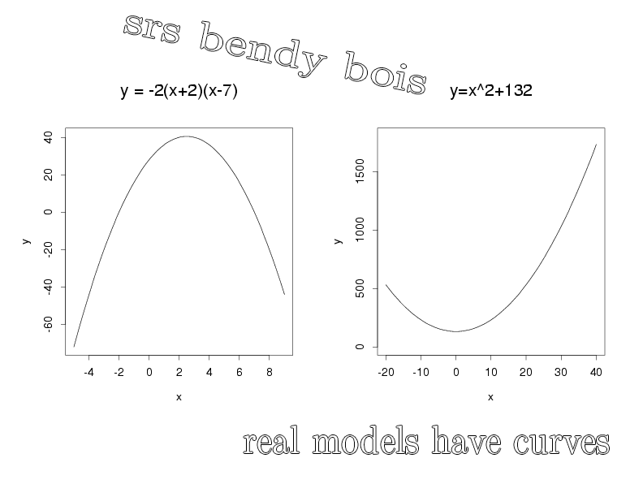

```{r setup, purl=FALSE}
#| include: false
options(width = 68)
set.seed(7)
knitr::opts_chunk$set(eval=TRUE, echo=TRUE, message=FALSE, warning=FALSE, dev = "svg", fig.height = 4)
```


# Today

Comparing Models

Functional Forms

* Logs
* Polynomials

Residual Plots

* Non-linearities
* QQ Plots

---

# Setup

Let's pick up where we left off last week with `communities` and a few different linear models to compare

.text-85[
```{r, message = FALSE, warning = FALSE}
library(tidyverse)
library(broom) 
communities <- 
  read_csv("https://clanfear.github.io/ioc_iqa/_data/communities.csv") |>
  mutate(across(c(incarceration, disadvantage), 
                ~ factor(., levels = c("Low", "Medium", "High"))))

lm_1 <- lm(crime_rate ~ disadvantage, data = communities)
lm_2 <- lm(crime_rate ~ disadvantage + pop_density, data =communities)
lm_3 <- lm(crime_rate ~ disadvantage + pop_density + area, 
           data = communities)
```
]

---

# Specification Tests

**Specification tests** are hypothesis tests for evaluating how well a model fits

--

They can be used to test if...

* One model fits better than another

--

* Coefficients are equal to a value (e.g., 0) or to each other

   * The t-test in regression output is doing this!
   * Useful if you're considering *combining* two variables

--

* Many other assumptions are violated

--

&nbsp;

.text-center[
*We'll do all of these things by the end of the term, but for now, let's focus on *comparing models**
]

---

# `anova()` for Comparisons

The `anova()` function can be used to compare linear models

```{r}
anova(lm_2, lm_3)
```


This produces a chi-square test of whether a given specification significantly reduces the sum of squares—that is, whether it fits better

--

Here `area` does *not* statistically significantly improve the model

--

This statistical test requires one model be **nested** in the other

---

# Nested Models

Models are nested if every variable in the *less complex* model is included in the *more complex model*

--

When models are nested, we say...

* The less complex one is the **restricted model**
* The more complex one is the **unrestricted model**

--

*What exactly is **restricted**?*

--

Excluding a variable from a model is equivalent to settings its *coefficient to zero*

* i.e., we *restrict the coefficient to zero* when we omit that variable

--

When we exclude a path from a DAG, we *assume a coefficient of zero for that path*

* We can test this assumption using `anova()` and other specification tests
* e.g., if our DAG indicated no direct effect of `area` on `crime_rate`, the prior test would support that assumption

---

# Another Example

```{r}
anova(lm_1, lm_2, lm_3)
```

We can give `anova()` any number of models

* Best to start with the *least complex* or *most restricted*
* Each model is compared to the one directly above it

---

# Warning

Adding a collider to a model will almost always improve fit

* `anova()` only tests if the model fits better
* `anova()` doesn't know about your DAG

--

.text-85[
```{r}
lm_4 <- lm(crime_rate ~ disadvantage + incarceration, data = communities)
anova(lm_1, lm_4)
```
]

--

**Theory** is your first guide for what to include or not

This test is mainly to see if it is okay to exclude *potential confounder*

---
class: inverse

# Polynomials

&nbsp;



---
# London Boroughs

Let's return to the (real!) 2021 crime data from London boroughs...

--

```{r}
metro_wide <- read_csv("https://clanfear.github.io/ioc_iqa/_data/metro_2021_violence_wide.csv")
head(metro_wide)
```

But in **wide** format this time

---
# Wide Data

**Wide data** are data where at least one variable occupies *multiple columns*


```{r}
dim(metro_wide)
names(metro_wide)
```

Here the **month** variable is in the *column names* and counts of **violent** crime are under each month

--

How could we plot crime by month with these data?

---

# Tidy Data

What we want is data in **tidy** format

--

Tidy data (aka "long data") are such that:

1. The values for a single observation are in their own row
2. The values for a single variable are in their own column
3. There is only one value per cell<sup>1</sup>

.footnote[[1] What one value means is subjective—it could be an entire dataset]

--

Why do we want tidy data?

* Easier to understand many rows than many columns
* Required for plotting in ggplot2
* Required for most statistical procedures
* Fewer issues with missing values

--

*So how do we **tidy** things up?*

---

# Pivoting

The `{tidyr}` package in `{tidyverse}` was built to get data into tidy format

```{r}
metro_long <- metro_wide |>
  pivot_longer(starts_with("month"), # Take each month column #<<
               names_to  = "month", # Put col names in month column #<<
               values_to = "violence") # Put values in violence column #<<
metro_long |> select(borough, month, violence) |> head(3)
dim(metro_long)
```


.pull-right[
.footnote[Way fewer columns and way more rows!]
]

---

# How it works

&nbsp;


.footnote[Source: [Garrick Aden-Buie](https://github.com/gadenbuie/tidyexplain#pivot-wider-and-longer)]

---

# `parse_number()`

```{r}
metro_long <- metro_long |>
  mutate(month = parse_number(month))
head(metro_long)
```


---

# Usual `lm()`

Let's fit a simple model predicting crime by month

```{r}
lm_viol <- lm(violence ~ month, data = metro_long)
lm_viol |> tidy() |> select(term, estimate, std.error)
```

--

But would we expect crime to increase (or decrease) from January to December?

--

Or is it more likely to range *up and down* through the year?

---

# Looking at Residuals

Looking at residuals can help us figure this out

.pull-left[
```{r viol-resid-1, fig.show='hide'}
lm_viol |> 
  augment() |>
  ggplot(aes(x = month, y = .resid)) + 
  geom_point()
```
]
.pull-right[
`)
]

Residuals should be flat with respect to predictors

With a lot of spread-out data points, it can be hard to tell if there is anything going on

---

# Looking at Residuals

`geom_smooth()` can help us diagnose problems

By default, it fits a **spline**—a flexible curved line

.pull-left[
```{r viol-resid-2, fig.show='hide'}
lm_viol |> 
  augment() |>
  ggplot(aes(x = month, y = .resid)) + 
  geom_point() + 
  geom_smooth() #<<
```
]
.pull-right[
`)
]

It looks like we're failing to account for a curved relationship

* You can't remove a *curve* by subtracting a *straight line*

---

# Quadratic Polynomials

**Quadratic polynomials** 


```{r}
lm_viol_2 <- lm(violence ~ month + I(month^2), data = metro_long)
lm_viol_2 |> tidy() |> select(term, estimate, std.error)
```


Introduce a quadratic polynomial


---

Run the model


---

Plot the residuials


---

Interpet the model


---

Bring back the calculus from first week

---
class: inverse

# Comparing Polynomials


---

Anova comparison

---

ggplot(metro_2021, aes(x = month, y = violence_and_sexual_offences)) + geom_point() + geom_smooth()

ggplot(metro_2021, aes(x = month, y = violence_and_sexual_offences)) + geom_point() + geom_smooth(method = "lm", formula = y ~ x + I(x^2))

fixest::feols(violence_and_sexual_offences ~ month + I(month^2) | borough, data =  metro_2021 |> mutate(month = lubridate::month(month)))