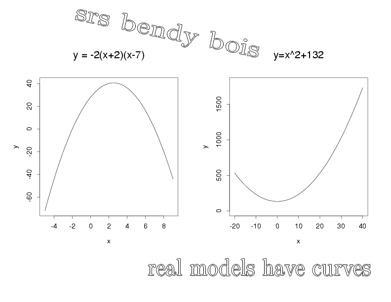

```{r setup, purl=FALSE}
#| include: false
options(width = 68)
set.seed(7)
knitr::opts_chunk$set(eval=TRUE, echo=TRUE, message=FALSE, warning=FALSE, dev = "svg", fig.height = 4)
```


# Today

### Comparing Models

### Pivoting Data

### Polynomials

### Residual Plots


---

# Setup

Let's pick up where we left off last week with `communities` and a few different linear models to compare

.text-85[
```{r, message = FALSE, warning = FALSE}
library(tidyverse)
library(broom) 
communities <- 
  read_csv("https://clanfear.github.io/ioc_iqa/_data/communities.csv") |>
  mutate(across(c(incarceration, disadvantage), 
                ~ factor(., levels = c("Low", "Medium", "High"))))

lm_1 <- lm(crime_rate ~ disadvantage, data = communities)
lm_2 <- lm(crime_rate ~ disadvantage + pop_density, data =communities)
lm_3 <- lm(crime_rate ~ disadvantage + pop_density + area, 
           data = communities)
```
]

---

# Specification Tests

**Specification tests** are hypothesis tests for evaluating how well a model fits

--

They can be used to test if...

* One model fits better than another

--

* Coefficients are equal to a value (e.g., 0) or to each other

   * The t-test in regression output is doing this!
   * Useful if you're considering *combining* two variables

--

* Many other assumptions are violated

   * *We'll see some of these another day*

--

&nbsp;

.text-center[
*We'll do all of these things by the end of the term, but for now, let's focus on **comparing models***
]

---

# `anova()` for Comparisons

The `anova()` function can be used to compare linear models

```{r}
anova(lm_2, lm_3)
```


This produces a chi-square test of whether a given specification significantly reduces the sum of squares—that is, whether it fits better

--

Here `area` does *not* statistically significantly improve the model

--

This statistical test requires one model be **nested** in the other

---

# Nested Models

Models are nested if every variable in the *less complex* model is included in the *more complex model*

--

When models are nested, we say...

* The less complex one is the **restricted model**
* The more complex one is the **unrestricted model**

--

*What exactly is **restricted**?*

--

Excluding a variable from a model is equivalent to settings its *coefficient to zero*

* i.e., we *restrict the coefficient to zero* when we omit that variable

--

When we exclude a path from a DAG, we *assume a coefficient of zero for that path*

* We can test this assumption using `anova()` and other specification tests
* e.g., if our DAG indicated no direct effect of `area` on `crime_rate`, the prior test would support that assumption

---

# Another Example

```{r}
anova(lm_1, lm_2, lm_3)
```

We can give `anova()` any number of models

* Best to start with the *least complex* or *most restricted*
* Each model is compared to the one directly above it

---

# Warning

Adding a collider to a model will almost always improve fit

* `anova()` only tests if the model fits better
* `anova()` doesn't know about your DAG

--

.text-85[
```{r}
lm_4 <- lm(crime_rate ~ disadvantage + incarceration, data = communities)
anova(lm_1, lm_4)
```
]

--

**Theory** is your first guide for what to include or not

This test is mainly to see if it is okay to exclude *potential confounder*

---
class: inverse

# Pivoting Data


.footnote[Source: [Garrick Aden-Buie](https://github.com/gadenbuie/tidyexplain#pivot-wider-and-longer)]

---
# London Boroughs

Let's return to the (real!) 2021 crime data from London boroughs...

--

```{r}
metro_wide <- read_csv("https://clanfear.github.io/ioc_iqa/_data/metro_2021_violence_wide.csv")
head(metro_wide)
```

But in **wide** format this time

---
# Wide Data

**Wide data** are data where at least one variable occupies *multiple columns*


```{r}
dim(metro_wide)
names(metro_wide)
```

Here the **month** variable is in the *column names* and counts of **violent** crime are under each month

--

How could we plot crime by month with these data?

---

# Tidy Data

What we want is data in **tidy** format

--

Tidy data (aka "long data") are such that:

1. The values for a single observation are in their own row
2. The values for a single variable are in their own column
3. There is only one value per cell<sup>1</sup>

.footnote[[1] What one value means is subjective—it could be an entire dataset]

--

Why do we want tidy data?

* Easier to understand many rows than many columns
* Required for plotting in ggplot2
* Required for most statistical procedures
* Fewer issues with missing values

--

*So how do we **tidy** things up?*

---

# Pivoting

The `{tidyr}` package in `{tidyverse}` was built to get data into tidy format

```{r}
metro_long <- metro_wide |>
  pivot_longer(starts_with("month"), # Take each month column #<<
               names_to  = "month", # Put col names in month column #<<
               values_to = "violence") # Put values in violence column #<<
metro_long |> select(borough, month, violence) |> head(3)
```

--

```{r}
dim(metro_long)
```


.pull-right-60[
.footnote[Way fewer columns and way more rows!]
]

---

# How it works


.footnote[Source: [Garrick Aden-Buie](https://github.com/gadenbuie/tidyexplain#pivot-wider-and-longer)]

---

# `parse_number()`

To make `month` analytically friendly, we can convert it from strings like `"month_1"` to numbers using `parse_number()`

```{r}
metro_long <- metro_long |>
  mutate(month = parse_number(month))
head(metro_long)
```

--

Now we can run some models again—but first, let's see *pivoting back*

---

# `pivot_longer()`

Maybe you *want* the wider data, because your model needs it (e.g., SEM) or to make a data table

```{r}
metro_wide_again <- metro_long |>
  pivot_wider(names_from   = month, # Turn months into col names #<<
              values_from  = violence, # Turn violence in col values #<<
              names_prefix = "month_") # Start col names with month_ #<<
metro_wide_again |>  head(3)
```

---
class: inverse

# Polynomials

&nbsp;




---

# Usual `lm()`

Let's fit a simple model predicting crime by month

```{r}
lm_viol <- lm(violence ~ month, data = metro_long)
lm_viol |> tidy() |> select(term, estimate, std.error)
```

--

But would we expect crime to increase (or decrease) from January to December?

--

Or is it more likely to range *up and down* through the year?

---

# Looking at Residuals

Looking at residuals can help us figure this out

* Recall that residuals are *what our model isn't predicting*

.pull-left[
```{r viol-resid-1, fig.show='hide'}
lm_viol |> 
  augment() |>
  ggplot(aes(x = month, 
             y = .resid)) + 
  geom_point() +
  geom_hline(yintercept = 0, 
             color = "red")
```
]
.pull-right[
`)
]

--

The residuals should have a mean of zero at every value of month

* i.e., they should not appear to follow a *curve*

--

With many data points it can be hard to tell if there is anything going on!

---

# Looking at Residuals

`geom_smooth()` can help us diagnose problems

By default, it fits a **spline**—a flexible curved line

.pull-left[
```{r viol-resid-2, fig.show='hide'}
lm_viol |> 
  augment() |>
  ggplot(aes(x = month, 
             y = .resid)) + 
  geom_point() +
  geom_hline(yintercept = 0, 
             color = "red") +
  geom_smooth() #<<
```
]
.pull-right[
`)
]

--

It looks like we're failing to account for a curved relationship

* We're underpredicting crime in the summer
* We're overpredicting crime in the winter

--

*So why not make a curved line?*


---
# Polynomial curves

Recall that a *squared* term (e.g. $x^2$) in an equation creates a *parabola*:

$$y = 2 + 0.5x + 0.25x^2$$


```{r}
#| fig.height: 3
#| fig.width: 6
#| fig.align: "left"
curve(2 + 0.5*x + 0.25*x^2, from = -3, to = 1, ylab = "y")
```

--

We can create these in our regression model!

---

# Quadratic polynomials

We can create the quadratic term directly in the formula using `I(x^2)` for any `x`<sup>1</sup>

```{r}
lm_viol_2 <- lm(violence ~ month + I(month^2), data = metro_long)
lm_viol_2 |> tidy() |> select(term, estimate, std.error, p.value)
```
.footnote[[1] We could also create a squared term in the data using `mutate()`]

--

The statistical significance of the new term suggests there is indeed a **non-linear** association between `month` and `violence`

* We could also compare it to the model without the term (and we'd come to the same conclusion)

---

# Our New Line

`geom_smooth()` can produce polynomials using the same formula

--

.pull-left[
```{r viol-curve, fig.show='hide'}
metro_long |> 
  ggplot(aes(x = month, 
             y = violence)) + 
  geom_point() +
  geom_smooth(
    method = "lm",
    formula = y ~ x + I(x^2)) #<<
```
]
.pull-right[
`)
]

--

That's a pretty strong curve!

Looks like violence peaks in the summer—something we'd expect theoretically!

---

# Plotting Residuals

We can use the residuals from the new model for a diagnostic plot

--

.pull-left[
```{r viol-resid-3, fig.show='hide'}
lm_viol_2 |> 
  augment() |>
  ggplot(aes(x = month, 
             y = .resid)) + 
  geom_point() +
  geom_hline(yintercept = 0, 
             color = "red") +
  geom_smooth() #<<
```
]
.pull-right[
`)
]

--

Looks like the quadratic term fixed the problem!

There's still a lot of noise, but we don't appear to be **systematically** wrong anymore

---

# Interpretation

```{r}
lm_viol_2 |> tidy() |> select(term, estimate, std.error, p.value)
```

How do we interpret this model?

--

* Does it make sense to interpret the terms *separately*?

--

* "Month squared" can't increase without month increasing—we can't "hold one constant"

--

.text-center[*Remember: Coefficients are the **slopes** of lines, and curves have different slopes in different places!*]

---

# Derivatives Return

In week one we looked at derivatives as a way to get the slope of a curve at a given location

--

Given $y = a + x^n$, $\frac{dy}{dx} = nx^{n-1}$

* Delete any terms without $x$ (e.g., $a$ gets dropped)
* Premultiply by exponents, then divide by $x$ (e.g.,  $x^3$ becomes $3x^2$ )

--

So...

* $violent = 431 + 62.5month -4month^2$
* $\frac{dy}{dx} = 62.5 -8month$
* When $month = 6$ (June) the slope is $62.5 - 48 = 14.5$.

--

For polynomials, the effect of a one unit change depends where you look:

* The expected "effect" on crime of "adding another month" in June is 14.5

--

.text-center[*We'll spend more time with this later!*]

---
class: inverse

# Comparing Polynomials


---

# Using $R^2$

Let's go a step further with a **cubic** model and look at their fit statistics

```{r}
lm_viol_3 <- lm(violence ~ month + I(month^2) + I(month^3), 
                data = metro_long)
rbind(glance(lm_viol), glance(lm_viol_2), glance(lm_viol_3)) |> 
  select(r.squared, adj.r.squared)
```

How do they compare?

--

Looks like the cubic model isn't helping much!

---

# Using `anova()`

We can test the models against each other formally with `anova()` as before

```{r}
anova(lm_viol, lm_viol_2, lm_viol_3)
```


How do they compare?

--

No support for the cubic model here either!

---

# Fitted vs. Residuals

Before we plotted residuals against `month`—but a more general diagnostic is plotting residuals against the fitted values

.pull-left[
```{r resid-fit, fig.show='hide'}
lm_viol |> 
  augment() |>
  ggplot(aes(x = .fitted, 
             y = .resid)) + 
  geom_point() +
  geom_hline(yintercept = 0, 
             color = "red") +
  geom_smooth()
```
]
.pull-right[
`)
]

This looks very familiar—it still suggests there's a curve!

---

# Again

This one looks a little different with our quadratic term

.pull-left[
```{r resid-fit-2, fig.show='hide'}
lm_viol_2 |> 
  augment() |>
  ggplot(aes(x = .fitted, 
             y = .resid)) + 
  geom_point() +
  geom_hline(yintercept = 0, 
             color = "red") +
  geom_smooth()
```
]
.pull-right[
`)
]

It still looks like we're doing a good job, though maybe there's a *bit* of poor prediction for very high values

--

Basic guidelines:

* The line should be fairly straight
* Residuals should be similarly spread out at every fitted value
* Keep an eye out for outliers—points very far from the line

---
class: inverse

# Wrap-Up

Reading:

* Huntington-Klein, N. (2022) *The Effect: An Introduction to Research Design and Causality*, New York, NY: Chapman and Hall/CRC Press. 
   * Read the rest of Chapter 13: Regression

* Kaplan, J. (2022) *Crime by the Numbers: A Criminologist's Guide to R*
   * Read [Chapter 13: Reshaping data](https://crimebythenumbers.com/reshaping.html)