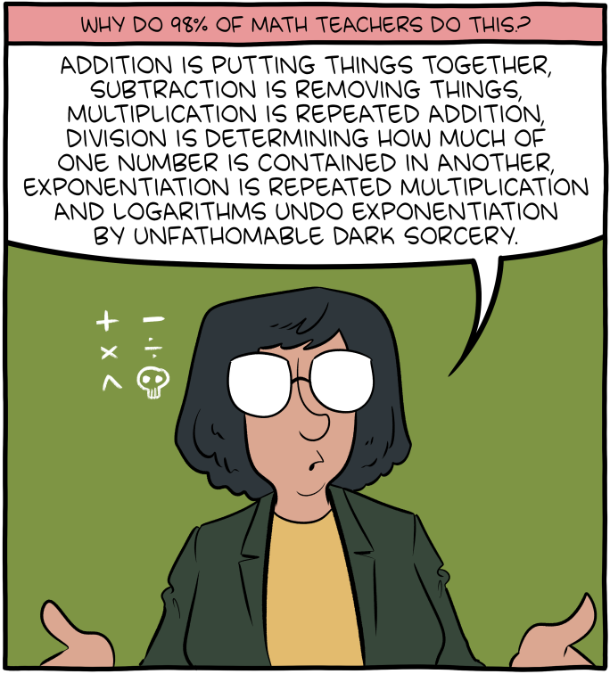

```{r setup, purl=FALSE}
#| include: false
options(width = 68)
set.seed(7)
knitr::opts_chunk$set(eval=TRUE, echo=TRUE, message=FALSE, warning=FALSE, dev = "svg", fig.height = 4)
```


# Today

### Joining Data

### Logarithms

### Moderation

---

# Loading Data


```{r}
library(tidyverse)
library(broom)
library(janitor)
```


Often you have multiple sources of data that you want to use together

.text-85[
```{r}
metro_2021_crime    <- 
  read_csv("https://clanfear.github.io/ioc_iqa/_data/metro_2021_crime.csv")
borough_deprivation <- 
  read_csv("https://clanfear.github.io/ioc_iqa/_data/borough_deprivation.csv")
borough_pop_density <- 
  read_csv("https://clanfear.github.io/ioc_iqa/_data/borough_pop_density.csv")
london_subregion    <- 
  read_csv("https://clanfear.github.io/ioc_iqa/_data/london_subregion.csv")
```
]

---

# Taking a Look

```{r, purl=FALSE, include = FALSE}
options(width = 40)
```


.text-85[
.pull-left[
```{r}
names(metro_2021_crime)
names(london_subregion)
names(borough_pop_density)
names(borough_deprivation)
```
]
.pull-right[
```{r}
dim(metro_2021_crime)
```

<p style="margin-bottom:2.25cm;">&nbsp;</p>

```{r}
dim(london_subregion)
dim(borough_pop_density)
dim(borough_deprivation)
```

]
]

```{r, purl=FALSE, include = FALSE}
options(width = 68)
```

---

# Joining Data


---

# Some Setup

Let's pick up where we left off last week with `metro_2021`

```{r, message = FALSE, warning = FALSE}

metro_2021 <- read_csv(
  "https://clanfear.github.io/ioc_iqa/_data/metro_2021_full.csv") |>
  rename(violence = violence_and_sexual_offences,
         asb      = antisocial_behaviour) |>
  mutate(month    = lubridate::month(month),
         pop_den = (pop/area)/1000)
```

Things done:

* Shorten a couple names
* Convert `month` to an integer
* Create a population density (`pop_den`) in thousands per $km^2$

---

# Last Week's Model

We created a curve with a **quadratic** functional form of `month`

.pull-left[
.text-85[
```{r}
lm_sq <- lm(violence ~ month + I(month^2), 
   data = metro_2021) 
lm_sq |> tidy() |> 
  select(term, estimate, std.error)
```
]
]
.pull-right[
```{r, echo=FALSE}
#| fig.height =4.25
ggplot(metro_2021, aes(x = month, y = violence)) + 
  geom_point() + 
  geom_smooth(method = "lm", 
              formula = y ~ x + I(x^2))
```
]

--

This fits our data well, but has drawbacks:

* Uses two parameters
* Complicated interpretation


---
class: inverse

# Logarithms



---

# One Parameter Curve

`log()` provides an alternative single parameter curve

.pull-left[
.text-85[
```{r}
lm_log <- lm(violence ~ log(month), 
   data = metro_2021)
lm_log |> tidy() |> 
  select(term, estimate, std.error)
```
]
]
.pull-right[
```{r, echo=FALSE}
#| fig.height =4.25
ggplot(metro_2021, aes(x = month, y = violence)) + 
  geom_point() + 
  geom_smooth(method = "lm", 
              formula = y ~ log(x))
```
]

--

In this case, it doesn't look like a great fit

* These models are not **nested** so they cannot be compared with `anova()`
* *We'll see a tool to compare these shortly*

--

.text-center[
*But first, what is `log()` anyway?*
]

---

# Quick Maths


Exponentiation, $b^{n} = x$, multiplies a number (the **base**, $b$) by itself $n$ times:

$$5^2 = 5*5 = 25$$

--

Roots, $\sqrt[n]{x} = b$ give the base you'd need to raise to power $n$ to get $x$:

$$\sqrt[2]{25} = 25 / 5 = 5$$


--

Logarithms, $log_{b}(x) = n$, give the $n$ to which you raise $b$ to get $x$:

$$log_{5}(25) = 2$$
.text-center[
*To get 25, you raise 5 (the base) to the power of 2*
]

--

In statistics and maths, we often use *Euler's number* (~2.718), $e$, as a base

* $log_{e}(x)$ is the **natural logarithm** and $e^n$ is the **exponential function**
--

* `log(x)` is $log_{e}(x)$ or $ln(x)$ and `exp(n)` is $e^n$
--

* `log(exp(x))` and `exp(log(x))` are both equal to `x`!

---

# Natural Logs

.pull-left[

```{r}
exp(1:3)
curve(exp(x), from = 1, to = 3)
```
]

--

.pull-right[

```{r}
log(1:3)
curve(log(x), from = 1, to = 3)
```
]

--

These are useful because they produce *curves* with simple derivatives:

$$\frac{d}{dx}e^x = e^x, \frac{d}{dx}log_e(x) = \frac{1}{x}$$

---

# `log(x)` Interpretation

```{r}
lm_log |> coef()
```

Natural logs allow for a special interpretation called an *elasticity* or *partial elasticity*

--

When only an independent variable is logged:

* Divide the $x$ coefficient by 100 and it is the amount $y$ differs due to a $1\%$ difference in $x$

* A $1%$ increase in `month` is associated with .64 more `violence`

---

# `log(y)` Interpretation

```{r}
lm(log(violence) ~ month, 
   data = metro_2021) |> coef()
```

You can also log the *outcome*

--

When only the dependent variable is logged:

* Multiply an $x$ by 100 and it is the percent $y$ differs due to a difference in $x$

* An increase of 1 in `month` is associated with $1.7\%$ higher `violence`

---

# Log-log Models

```{r}
lm(log(violence) ~ log(month), 
   data = metro_2021) |> coef()
```

If we log both $x$ and $y$ we get a *log-log* or *elasticity* model

--

When both $x$ and $y$ are logged:

* The $x$ coefficient is the percent $y$ differs due to a percent difference in $x$

* A $1\%$ increase in `month` is associated with a $0.11\%$ increase in `violence`


---

# Working with Logs

By compressing higher values, they reduce *skew*

* This tends to reduce **heteroskedasticity**
* Makes some models easier to estimate

--

Some warnings: 

* You can only take a log of a positive (non-zero) number!
* The curve is *inflexible*
* The percentage interpretation is an *approximation*
   * Inaccurate for changes in $x$ smaller or greater than $1$

---
class: inverse

# Moderation 

## Using Interaction Terms

&nbsp;

.text-150[
> Moderation in all things is best, but it's pretty hard to get excited about it. — Mason Cooley
]

---

# Moderation

**Moderation** occurs when the association between $x$ and $y$ is different across values of another variable $z$ 

--

This implies a **multiplicative** relationship rather than just an **additive** one

* **Additive**: $y = b_1x + b_2z$
* **Multiplicative**: $y = b_1x + b_2z + b_3xz$

--

Note that we obey **hierarchy**: Include $x$ and $z$ alone when using $x*z$<sup>1</sup>

.footnote[
[1] There are *rare* cases when you drop one or both first order terms

&nbsp;
]

--

.pull-left[

Note that DAGs moderation is not indicated by DAGs<sup>2</sup>

Moderation is a type of *functional form* like polynomials or logarithms
]

.pull-right[
```{tikz mod-dag, fig.width = 2.75, cache = TRUE, purl = FALSE, echo = FALSE}
\usetikzlibrary{positioning}
\definecolor{black}{HTML}{000000}
\tikzset{
    > = stealth,
    every node/.append style = {
        draw = none,
        scale = 3
    },
    every path/.append style = {
        arrows = ->,
        draw = black,
        fill = none,
        scale = 1,
        line width = 1.5mm
    },
    hidden/.style = {
        draw = black,
        shape = circle,
        inner sep = 1pt
    }
}
\tikz{
  \node (Y) at (0, 1.25) {$Y$};
  \node (Z) at (5, 0) {$Z$};
  \node (X) at (5, 2.5) {$X$};
  \path (X) edge (Y);
  \path (Z) edge (Y);
  }
```
]

.footnote[
[2] Arrows pointing to other arrows are used in path diagrams but *not* DAGs
]


---

# Visual Moderation

Moderation produces *different slopes* for $x$ at each value of $z$

--

For categorical $z$, this may be represented with a regression line for each level of $z$

.pull-left[
```{r int-plot, fig.show='hide'}
ggplot(metro_2021 , 
    aes(x     = pop_den, 
        y     = violence, 
        color = deprivation)) + 
  geom_point() + 
  geom_smooth(method = "lm")
```
]
.pull-right[
`)
]

--

`pop_den` has a negative slope only for "medium" `deprivation` boroughs

* *Crime is lower when population density is higher in boroughs with moderate deprivation*
* *Crime is higher when population density is higher in boroughs with low and high deprivation*

---

# Moderation Formula

We can fit a model with moderation by *multiplying variables* in the formula

```{r}
lm_int <- lm(violence ~ deprivation*pop_den, data = metro_2021)
lm_int |> tidy() |> select(term, estimate, statistic)
```

--

By default, it will obey **hierarchy** and include the first-order terms

---

# Interpretation

Interactions need to be interpreted using (partial) derivatives like polynomials

Our equation:

$$y = 632 -205*depLow + 318*depMed + 6.4*popDen + \\
4.0*depLow*popDen - 37*depMed*popDen$$

--

The estimated effect of `pop_den` is the *partial derivative*:

$$\beta_{dpopDen} = \frac{dviolence}{dpopDen} = 6.4 + 4*depLow + -37*depMed$$

--

We can calculate the effect of `pop_den` when `deprivation` is... 

\begin{align}
\text{Low: } & \beta_{dpopDen} = 6.4 + 4*1 + -37*0 =\hphantom{-} 10.4\\
\text{Moderate: } & \beta_{dpopDen} = 6.4 + 4*0 + -37*1 = -30.6\\
\text{High: } & \beta_{dpopDen} = 6.4 + 4*0 + -37*0 =\hphantom{-} 6.4
\end{align}

---

# Specification Test

You can test if an interaction is warranted, because the interaction model is nested in the **additive** model:

.text-85[
```{r}
lm_noint <- lm(violence ~ deprivation + pop_den, data = metro_2021)
anova(lm_int, lm_noint)
```

]


---
class: inverse

# Wrap-Up

