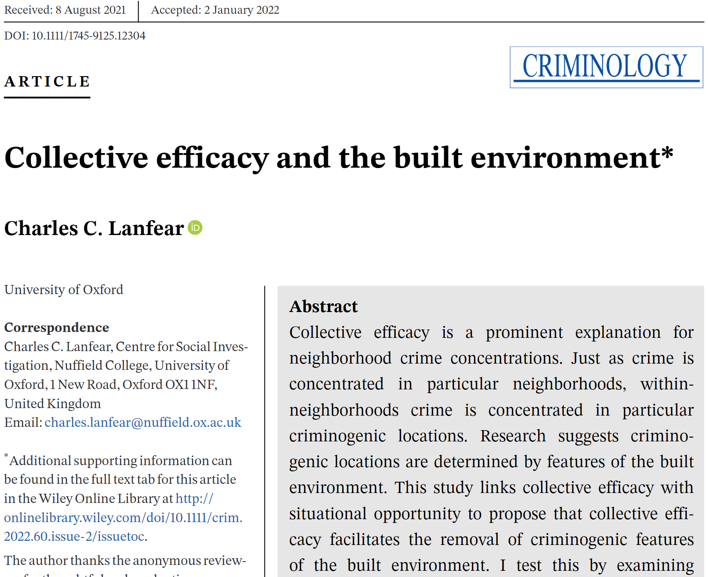
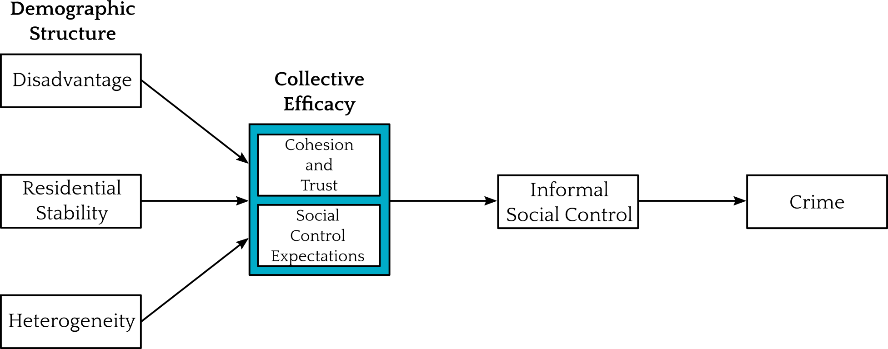
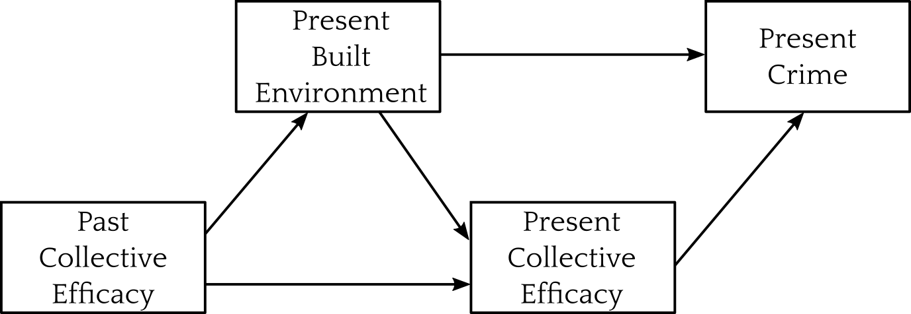
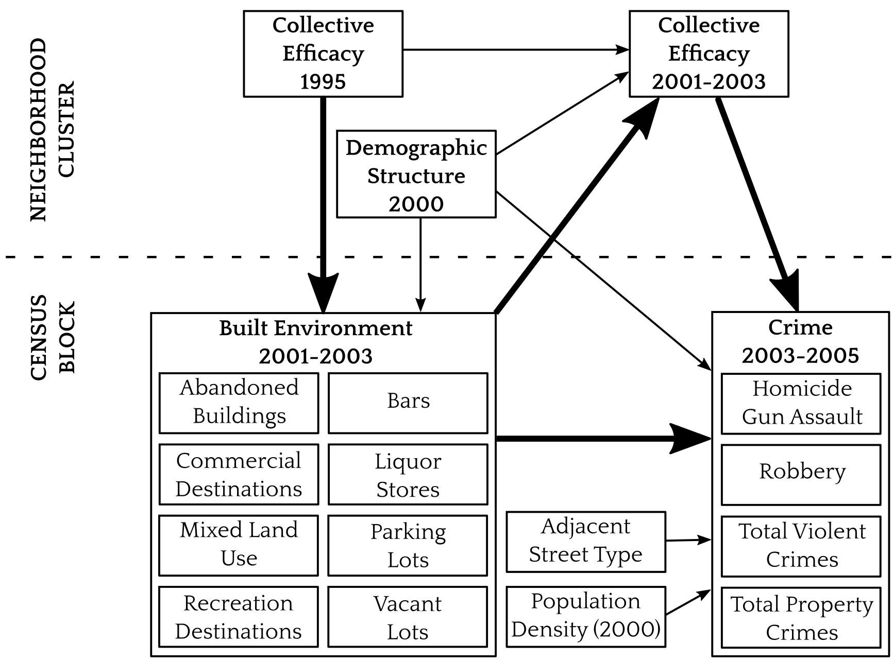

```{r setup, purl=FALSE}
#| include: false
options(width = 68)
set.seed(7)
knitr::opts_chunk$set(eval=TRUE, echo=TRUE, message=FALSE, warning=FALSE, dev = "svg", fig.height = 4)
```


# Today


* Example project

> Something where we expect effect to differ across different levels

> Build up to model, then interpret model

* When do what

* Further Learning


---

# Loading Data

```{r}
library(tidyverse)
library(broom) 

load(url("https://github.com/clanfear/built_environment_ce/raw/main/data/analytical_data/ccahs_block_analytical_unstd.RData"))
```

Today we'll be using real replication data from [Lanfear, Charles C. (2022). Collective Efficacy and the Built Environment. Criminology, 60(2)](https://github.com/clanfear/built_environment_ce)

These data describe:

* 1641 city blocks in 343 Chicago neighborhoods
* Crime in 2004–2006
* Survey data from 1995 and 2001–2003
* Census data from 2000


.footnote[
`url()` tells `load()` to look online for the file; `read_csv()` does this automatically!
]

---

.text-72[
```{r}
glimpse(ccahs_block_analytical_unstd)
```
]

---

```{r}
ccahs_block_analytical_unstd |> 
  summarize(across(where(is.numeric), list(mean = mean, sd = sd, min = min, max = max))) |>
  pivot_longer(everything()) |>
  mutate(measure = str_extract(name, "[a-z]+$"),
         name = str_remove(name, "_[a-z]+$"),
         value = round(value, 2)) |>
  pivot_wider(names_from = measure, values_from = value)
```


---
class: inverse

# Linking Theory to Models



---
## Collective Efficacy




---
## Routine Activity


---
## From the paper




.text-center[
*Collective efficacy impacts crime only through the built environment*
]

---
## The real diagram




---
## Neighborhood Model

```{r}
neighb_model <- 
  lm(CRIME_violent_2004_2006 ~ CE_hlm_2001 + CE_hlm_1995 + 
       FAC_disadv_2000 + FAC_stability_2000 + FAC_hispimm_2000, 
     data = ccahs_block_analytical_unstd)
```

```{tikz mod-dag, fig.width = 2.75, cache = TRUE, purl = FALSE, echo = FALSE}
\usetikzlibrary{positioning}
\definecolor{black}{HTML}{000000}
\tikzset{
    > = stealth,
    every node/.append style = {
        draw = none,
        scale = 2
    },
    every path/.append style = {
        arrows = ->,
        draw = black,
        fill = none,
        scale = 1,
        line width = 1.5mm
    },
    hidden/.style = {
        draw = black,
        shape = circle,
        inner sep = 1pt
    }
}
\tikz{
  \node (C) at (12, 3) {$CE_{1995}$};
  \node (A) at (6, 0) {$CE_{2001}$};
  \node (B) at (8, -3) {$Demog_{2000}$};
  \node (Y) at (0, 0) {$Crime$};
  \path (A) edge (Y);
  \path (B) edge (Y);
  \path (C) edge[color = gray] (Y);
  \path (B) edge (A);
  \path (C) edge (A);
  \path (C) edge (B);
  }
```


My theory says past collective efficacy predicts present crime...

...but only because of effects on the (unobserved) built environment

---
## Neighborhood Model Results

.text-80[
```{r}
summary(neighb_model)
```
]


---
## Full Model

The full model adds the built environment (opportunity) path:

.text-80[
```{r}
full_model <- 
  lm(CRIME_violent_2004_2006 ~ CE_hlm_2001 + CE_hlm_1995 + 
       FAC_disadv_2000 + FAC_stability_2000 + FAC_hispimm_2000 + density_ltdb_nc_2000 + 
       BE_pr_vacant_onstreet_block_2001 + BE_pr_abandoned_bld_onstreet_block_2001 +
       BE_pr_commer_dest_onstreet_block_2001 + BE_pr_recreation_block_2001 +
       BE_pr_parking_block_2001  + BE_pr_commercial_block_2001 + 
       BE_pr_bar_onstreet_block_2001 + BE_pr_liquor_onstreet_block_2001 + 
       density_block + I(density_block^2) + street_class_near, 
     data = ccahs_block_analytical_unstd)
```
]

```{tikz mod-dag-2, fig.width = 2.75, cache = TRUE, purl = FALSE, echo = FALSE}
\usetikzlibrary{positioning}
\definecolor{black}{HTML}{000000}
\tikzset{
    > = stealth,
    every node/.append style = {
        draw = none,
        scale = 2
    },
    every path/.append style = {
        arrows = ->,
        draw = black,
        fill = none,
        scale = 1,
        line width = 1.5mm
    },
    hidden/.style = {
        draw = black,
        shape = circle,
        inner sep = 1pt
    }
}
\tikz{
  \node (C) at (12, 2.5) {$CE_{1995}$};
  \node (A) at (6, 0) {$CE_{2001}$};
  \node (B) at (8, -2.5) {$Demog_{2000}$};
  \node (D) at (7, 2.5) {$BE_{2001}$};
  \node (Y) at (0, 0) {$Crime$};
  \path (A) edge (Y);
  \path (B) edge (Y);
  \path (C) edge[color = gray] (Y);
  \path (B) edge (A);
  \path (C) edge (A);
  \path (C) edge (B);
  \path (D) edge[color = red] (Y);
  \path (C) edge[color = red] (D);
  \path (B) edge (D);
  \path (D) edge[color = gray] (A);
  }
```


.footnote[
Note that only arrows going into **Crime** go into the model formula
]

---
## Full Model Results

.text-80[
```{r}
tidy(full_model) |> mutate(across(-term, ~round(., 3)))
```
]


---

## Non-Linearity

Note that there's a **quadratic** term: 

.text-80[
```{r}
full_noquad_model <- 
  lm(CRIME_violent_2004_2006 ~ CE_hlm_2001 + CE_hlm_1995 + 
       FAC_disadv_2000 + FAC_stability_2000 + FAC_hispimm_2000 + density_ltdb_nc_2000 + 
       density_block + street_class_near + 
       BE_pr_vacant_onstreet_block_2001 + BE_pr_abandoned_bld_onstreet_block_2001 +
       BE_pr_commer_dest_onstreet_block_2001 + BE_pr_recreation_block_2001 +
       BE_pr_parking_block_2001  + BE_pr_commercial_block_2001 + 
       BE_pr_bar_onstreet_block_2001 + BE_pr_liquor_onstreet_block_2001, 
     data = ccahs_block_analytical_unstd)
anova(full_noquad_model, full_model) |> tidy() |> mutate(p.value = round(p.value, 3))
```
]

---

## Quadratic Interpretation
```{r, include = FALSE}
est_vec <- full_model |> tidy() |> 
  filter(str_detect(term, "density_block")) |> 
  mutate(p.value = round(p.value, 3)) |>
  pull(estimate) |>
  round(2)
```

```{r}
full_model |> tidy() |> 
  filter(str_detect(term, "density_block")) |> 
  mutate(p.value = round(p.value, 3))
```

Effect of density: `r est_vec[1]` `r 2*est_vec[2]`*`density_block` 

--

```{r}
min(ccahs_block_analytical_unstd$density_block)
```

```{r}
max(ccahs_block_analytical_unstd$density_block)
```

---

## Moderation

When you want to know if a an effect differs by...

* Group
* Context (e.g., neighborhood)
* Characteristics (e.g., capability)

--

A reviewer asked if disadvantage (a context) **moderated** block-level built environment effects—a common finding in the opportunity literature

I tested this—and we can too!

---

## Moderation test

.text-80[
```{r}
full_int_model <- 
  lm(CRIME_violent_2004_2006 ~ CE_hlm_2001 + CE_hlm_1995 + 
       FAC_disadv_2000 + FAC_stability_2000 + FAC_hispimm_2000 + density_ltdb_nc_2000 + 
       density_block + density_block_2 + street_class_near + 
       FAC_disadv_2000*BE_pr_vacant_onstreet_block_2001 + 
       FAC_disadv_2000*BE_pr_abandoned_bld_onstreet_block_2001 +
       FAC_disadv_2000*BE_pr_commer_dest_onstreet_block_2001 + 
       FAC_disadv_2000*BE_pr_recreation_block_2001 +
       FAC_disadv_2000*BE_pr_parking_block_2001  + 
       FAC_disadv_2000*BE_pr_commercial_block_2001 + 
       FAC_disadv_2000*BE_pr_bar_onstreet_block_2001 + 
       FAC_disadv_2000*BE_pr_liquor_onstreet_block_2001, 
     data = ccahs_block_analytical_unstd)
anova(full_int_model, full_model) |> tidy()
```
]

Some evidence for moderation, but not strong enough to warrant inclusion!

I did toss the results in the appendix though

---

# Extensions

---

## Missing Data?

---

## Mediation

When you want to know if an effect works through a particular front door


---

## Unobserved Effects

"Fixed effects"

---
class: inverse

# Wrap-Up

## Freedom
